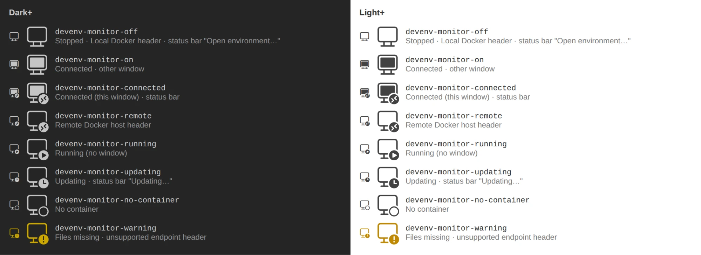

# Icon Set

The extension contributes eight icons (`contributes.icons` in `package.json`) from the font `resources/icons/devenv-icons.woff`. Each shows the monitor; a sign on the monitor gives the state. The icons use the theme's foreground colour, except where noted.

| Icon ID | Glyph | Icon | Where it's used |
|---|---|---|---|
| `devenv-monitor-off` | `\E001` | Switched-off monitor | Stopped · Local Docker header · status bar "Open environment…" · "Use the Local Docker" in the host picker |
| `devenv-monitor-on` | `\E002` | Switched-on monitor | Connected in another window |
| `devenv-monitor-connected` | `\E003` | Switched-on monitor with the connection sign | Connected in this window · status bar |
| `devenv-monitor-remote` | `\E004` | Switched-off monitor with the connection sign | Remote Docker host header |
| `devenv-monitor-running` | `\E005` | Switched-off monitor with a play sign | Running without a window |
| `devenv-monitor-updating` | `\E006` | Switched-off monitor with a clock | Updating · status bar "Updating…" |
| `devenv-monitor-no-container` | `\E007` | Switched-off monitor with a ring | No container |
| `devenv-monitor-warning` | `\E008` | Switched-off monitor with a warning sign | Files missing (warning colour) · unsupported-endpoint header |

The activity bar icon of the sidebar is `resources/icon.svg`, the codicon `open-in-window` (user request 2026-09-29).

The states are described in [6.2 Sidebar view](vscode-dev-environments.md#62-sidebar-view), the status bar in [6.3 Status bar](vscode-dev-environments.md#63-status-bar).
