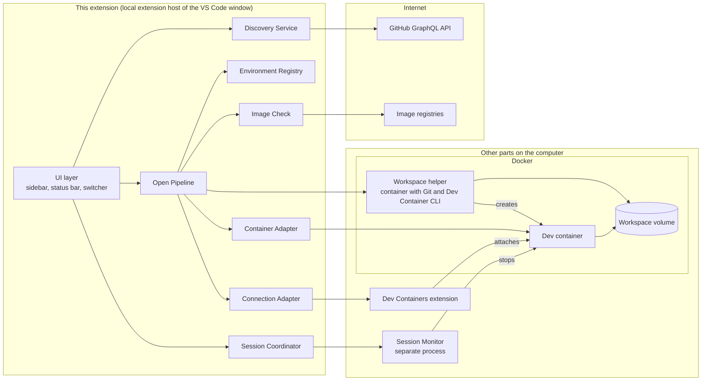
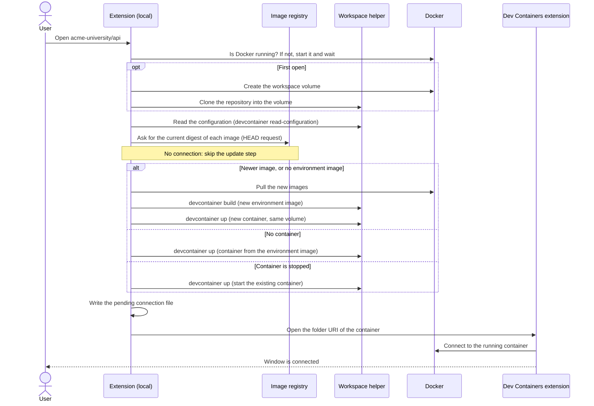
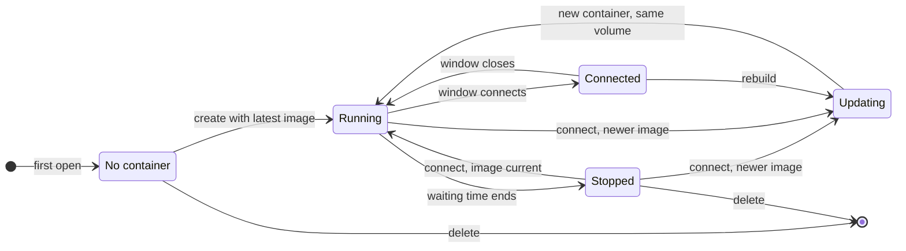

# Dev Environment Launcher — Concept

| Item | Value |
|---|---|
| Document type | Concept. This document contains no implementation. Code blocks show data structures and interfaces as illustration only. |
| Working title | Dev Environment Launcher (final name: see [D-1](#13-decisions)) |
| Product type | Visual Studio Code extension |
| Status | Draft for review |
| Date | 2026-09-24 |

## Contents

1. [Summary](#1-summary)
2. [Terms](#2-terms)
3. [Background](#3-background)
4. [Requirements](#4-requirements)
5. [Scope](#5-scope)
6. [User experience](#6-user-experience)
7. [Architecture](#7-architecture)
8. [Settings](#8-settings)
9. [Security and privacy](#9-security-and-privacy)
10. [Risks](#10-risks)
11. [Verification before implementation](#11-verification-before-implementation)
12. [Delivery phases](#12-delivery-phases)
13. [Decisions](#13-decisions)
14. [Alternatives considered](#14-alternatives-considered)
15. [References](#15-references)

---

## 1. Summary

The Dev Environment Launcher is an extension for Visual Studio Code (VS Code). It does three things:

1. It lists all GitHub repositories that the signed-in user can access and that contain a Dev Container configuration.
2. It opens a selected repository in a local dev container with one action.
3. It manages the environment for the user: it creates, updates, connects, switches, stops, and reopens environments automatically.

The user works only with this extension. The Dev Containers extension, Docker commands, and the Dev Container CLI are used internally and are not visible in the normal workflow.

Main behavior:

- **Start**: one action opens a repository in a dev container, in the current window. This is the local equivalent of the GitHub action "Create codespace on main".
- **Docker start**: if Docker is not running, the extension starts it and waits until it is ready.
- **Latest image**: before each connection, the extension checks whether a newer version of the container image exists. It compares image digests, not tag names, so this also works for tags without a fixed version, such as `:latest`. If a newer image exists, the extension pulls it and rebuilds the container before it connects. Without internet access, the extension skips this update step and starts the environment with the local image.
- **Work is kept**: the repository is stored in a Docker volume that belongs to the environment. A rebuild creates a new container and mounts the same volume. Uncommitted changes and unpushed commits are kept.
- **Switch**: while connected, the user can switch to another environment in the same window.
- **Stop on close**: when the VS Code window closes, the extension stops the container of this window after a short waiting time. A stopped container has no running processes and uses no memory. The workspace volume is kept.
- **Reopen**: when VS Code starts again, the last environment starts and connects automatically.

## 2. Terms

| Term | Meaning in this document |
|---|---|
| Dev Container configuration | A `devcontainer.json` file in a repository, as defined by the [Dev Container specification](https://containers.dev/implementors/spec/) |
| Environment | One repository in one workspace volume, plus the dev container that is created from one of its configurations |
| Workspace volume | A named Docker volume that contains the Git clone of the repository. It exists independently of the container. |
| Dev Containers extension | The Microsoft extension `ms-vscode-remote.remote-containers`. It connects a VS Code window to a container. |
| Dev Container CLI | The open-source command-line tool [`@devcontainers/cli`](https://github.com/devcontainers/cli). It builds and starts dev containers. |
| Workspace helper | A short-lived helper container of this extension. It contains Git and the Dev Container CLI, and it works on the workspace volume. |
| Image digest | The content hash (`sha256:…`) of an image in a registry. A tag such as `:latest` can point to a new digest at any time. A digest never changes. |
| Environment image | The image that the extension builds for an environment from its configuration: the base image plus the Dev Container Features. Containers are created from this image, also without internet access. |
| Build record | The name of the current environment image, and the digests of the images and Features that it was built from |
| Stop | Stop a container with `docker stop`. Its processes end, and it frees its memory. The container and the workspace volume stay, so the next start takes only seconds. |
| Waiting time | The time between "no window uses the environment" and "the extension stops the container". Default: 30 seconds. |
| Session Monitor | A small helper process of this extension. It stops containers when no window uses them anymore. |
| Open pipeline | The fixed sequence of steps that the extension runs to open, reopen, update, or reconnect an environment |

## 3. Background

On GitHub, the repository page offers the action "Create codespace on main". It creates a cloud development environment from the Dev Container configuration of the repository with one click.

For organizations and enterprises, GitHub includes no free Codespaces usage. This also applies to GitHub Enterprise Cloud from the GitHub Campus Program. Every codespace that an organization pays for is billed from the first hour.

This extension offers the same one-action experience with local containers. It uses the same `devcontainer.json` files, so the repositories need no changes. Like a codespace, an environment keeps the repository in storage that is separate from the container.

## 4. Requirements

### 4.1 Functional requirements

| ID | Requirement |
|---|---|
| FR-01 | The extension lists all repositories that the signed-in user can access and that contain a Dev Container configuration. |
| FR-02 | One action opens a listed repository in a local dev container. If the repository has no environment, the action creates one on the default branch. If the repository has an environment, the action opens this environment (see [6.2](#62-sidebar-view)). |
| FR-03 | The user can select a branch. If a repository has several configurations, the user can select one. Both selections apply to the one environment of the repository of the signed-in account (see [D-3](#13-decisions)). |
| FR-04 | No flow requires the user to use commands, views, or prompts of the Dev Containers extension. |
| FR-05 | While connected to an environment, the user can switch to another environment. |
| FR-06 | When a window closes, or when VS Code quits, the extension stops the container of that window. No process of the environment keeps running in the background, and the container uses no memory. |
| FR-07 | When VS Code starts, it reopens and connects the last used environment automatically. |
| FR-08 | Reconnection is automatic: the extension starts Docker if needed (FR-14), starts stopped containers, and creates missing containers again. |
| FR-09 | The user can rebuild and delete an environment. Before delete, the extension warns about uncommitted or unpushed changes. |
| FR-10 | The extension shows the state of each environment: connected, running, stopped. |
| FR-11 | Before each connection, the extension checks whether a newer version of each image of the configuration exists. If yes, it pulls the new image and rebuilds the container before it connects. The check also works for tags without a fixed version, such as `:latest`, and for images without a tag. |
| FR-12 | A rebuild always mounts the same workspace volume again. Uncommitted changes, unpushed commits, stashes, and untracked files are kept. |
| FR-13 | If an image registry cannot be reached, for example because no internet access is available, the extension skips the update step and starts the environment with the local images. The next connection checks again. |
| FR-14 | If Docker is not running, the extension starts it automatically and waits until it is ready. The user does not need to start Docker manually. |

### 4.2 Non-functional requirements

| ID | Requirement |
|---|---|
| NFR-01 | Ease of use: a new user reaches a running environment in three steps: sign in, select a repository, wait. |
| NFR-02 | Messages use plain language. Technical logs are shown only on request. |
| NFR-03 | The extension stores no secrets in its settings or global storage. GitHub access uses the built-in GitHub sign-in of VS Code. The token of the account that owns an environment is written into the workspace volume of that environment, as in a codespace. Docker keeps the volume on the disk of the computer (see [section 9](#9-security-and-privacy)). |
| NFR-04 | No container keeps running after a VS Code crash. A window reload and computer sleep do not stop a container that a window uses. |
| NFR-05 | Primary platform: macOS with Docker Desktop. Linux with Docker Engine is supported. Windows is supported with Docker Desktop and the WSL 2 back end. |
| NFR-06 | Internal details of the Dev Containers extension are used in one component only: the module `src/core/devContainers.ts` (the Connection Adapter encodes the folder URI with the literal of this module). A change in the Dev Containers extension affects only this component. |
| NFR-07 | Data safety: only the action **Delete** removes a workspace volume. An update never removes a working container before its replacement is ready. |
| NFR-08 | Without internet access, the update check delays the start of an environment by 5 seconds at most. |

## 5. Scope

**In scope for version 1:**

- Repositories on GitHub.com that the signed-in user can access: own repositories, repositories with collaborator access, and repositories of organizations where the user is a member (including GitHub Enterprise Cloud organizations).
- Local Docker: Docker Desktop (macOS, Windows, Linux) and Docker Engine (Linux).
- Configurations based on an image or a Dockerfile (phase 1), and on Docker Compose (phase 2, see [V-10](#11-verification-before-implementation)): a devcontainer.json with `dockerComposeFile` and `service` starts the dev container together with the other services of the configuration, for example a database.
- Public and private images in registries that Docker can access with its stored credentials.

**Out of scope for version 1:**

- Search across all public repositories on GitHub.
- Remote Docker hosts and cloud machines.
- Other container runtimes, for example OrbStack, Colima, Rancher Desktop, and Podman (Podman is planned for phase 3).
- GitHub Enterprise Server.
- GitHub Codespaces.

**Known limits:**

- The first open of a repository needs internet access: for the clone, and for the download of the images.
- The repository is in a Docker volume, not in a folder on the computer. Other programs on the computer cannot open the files directly.
- Configurations that mount files of the repository from the computer (variable `${localWorkspaceFolder}`) do not work, because the repository is not in a folder on the computer.
- Configurations that need access to the computer are refused, for example bind mounts, privileged mode, devices, and `initializeCommand`, and so are options of `runArgs` and `build.options` that the extension does not know (see [section 9](#9-security-and-privacy), "Host access").
- An environment belongs to the GitHub account that created it. Another account does not see it (see [section 9](#9-security-and-privacy), "Accounts"). Each account has its own environment of a repository, with its own clone (see [D-3](#13-decisions)): two accounts that work on the same repository need the disk space for two clones and two containers. A configuration whose named volumes have a name that depends only on the repository (a fixed name, or `${localWorkspaceFolderBasename}-…`) can be used by the environments of one account only: the environments of that account share the volume (for example a fork and its upstream repository), and the Start of another account is refused, because the environments of two accounts would share the volume (see [section 9](#9-security-and-privacy), "Host access"). A name with `${devcontainerId}` is different for each environment.
- Git older than version 2.9 in the container may use the Git credentials of the computer. The extension warns about it (see [section 9](#9-security-and-privacy), "Git inside the container").
- The Dev Containers extension and VS Code keep some channels between the container and the computer open, for example the SSH agent and the opening of URLs in the local browser (see [section 9](#9-security-and-privacy), "Host access").
- Only data in the workspace volume survives a rebuild. Data in other folders of the container, for example the home folder, is lost, unless the configuration stores it in an additional named volume (property `mounts`).
- Work that runs in the container after its window has closed, for example a long build in a terminal, ends when the container stops.
- On Linux with Docker Engine, the extension cannot start the Docker service, because this needs administrator rights (see [7.6](#76-open-pipeline)).

## 6. User experience

### 6.1 First start

1. The extension adds an icon to the activity bar. Its view shows a short welcome text and one button: **Sign in with GitHub**. The sign-in uses the built-in GitHub authentication of VS Code.
2. The extension checks that Docker is installed. If not, it offers the installation, like the sign-in: the view shows the welcome text "Dev Environments runs your environments in Docker, which is not installed on this computer." with the button **Install Docker…** above the sign-in (when the view lists environments, a row **Install Docker…** with a warning symbol at the top), and the first time the view shows, the message "Docker Desktop is not installed." with the action **Install Docker…**. While Docker is missing, the extension looks for the Docker command line tool every 10 seconds, so the offer disappears as soon as Docker is installed. **Install Docker…** opens the walkthrough "Set up Docker for Dev Environments", a wizard with one step per task, each checking itself off: on Windows, WSL 2 (`wsl --install`); Install Docker; Start Docker (Docker Desktop shows its own dialogs once at its first start); Sign in with GitHub. **Install Docker** runs the installer of the computer's platform (see [implementation notes 6](implementation-notes.md#6-docker)): on macOS with Homebrew and on Windows with winget in a terminal of VS Code, otherwise it downloads the installer of Docker Desktop from Docker and opens it; on Linux it installs Docker Engine from the package repository of Docker in the terminal. Before anything runs, a modal dialog lists the exact commands (or the download address and the target file) and says that an administrator password may be requested in the terminal. After the installation, the extension looks for Docker every 5 seconds for at most 30 minutes and then offers **Start Docker**. The installation runs only from a local window; a remote window says "Open a local window to install Docker." If Docker is installed but not running, the extension starts it later, when an environment needs it. Git on the computer is not needed, because the workspace helper contains Git.
3. The repository list loads. The first load can take some seconds; the view shows the repositories as they arrive. Later, the view shows the stored list at once and updates it in the background, which reads the configurations only of new and changed repositories (see [7.4](#74-repository-discovery)). With many repositories, **Select Organizations…** limits the list, and the scan, to some organizations.

### 6.2 Sidebar view

The sidebar shows one list of repositories of the signed-in GitHub account. The list contains:

- the repositories on GitHub that the account can access and that contain a Dev Container configuration (FR-01). This part of the list comes from GitHub (see [7.4](#74-repository-discovery)).
- every repository that has an environment of the account on this computer, also when GitHub does not list it anymore, for example after a loss of access. This part of the list comes from the Environment Registry and from Docker (see [7.5](#75-environment-model-and-workspace-volume)), so it is complete also without internet access.

Environments of another account are not in the list, and the list does not name or count them (see [7.5](#75-environment-model-and-workspace-volume)). A repository that has an environment of another account on this computer looks like any repository without environment: **Start** creates the environment of the signed-in account ([D-3](#13-decisions)). Without a sign-in, the view shows only the sign-in.

A repository has at most one environment per GitHub account (see [D-3](#13-decisions)): a workspace volume with a clone of the repository, plus its dev container (see [section 2](#2-terms)). The first **Start** of a repository by an account creates the environment of that account. The environment stays until the user selects **Delete**.

```text
DEV ENVIRONMENTS         [Select Organizations] [Search] [Refresh] [Collapse All]
  ▾ acme-university
      ● api        main (python)   Connected                  [Stop] [Delete] [⋯]
      ▶ docs       main            Running                    [Stop] [Delete] [⋯]
        infra                                                 [Start] [⋯]
      ○ web        feature-x       Stopped · 3 unpushed       [Start] [Delete] [⋯]
  ▾ your-account
      ○ dotfiles   main            Stopped                    [Start] [Delete] [⋯]
        website                                               [Start] [⋯]
```

The list groups the repositories by owner. In each group, the repositories are in alphabetical order; a repository with an environment keeps its place.

**Repository groups.** The setting `repositoryGroups` (see [section 8](#8-settings)) holds regular expressions (JavaScript syntax) that filter and group the repositories of each owner. Each one is matched against the repository name without the owner. An entry is the regular expression itself, or an object with `pattern`, an optional `name`, and optional `flags` (only `i`, `u`, and `s`; other flags are ignored with a warning).

- **Filter, per owner.** The regular expressions apply to each owner on its own. In an owner where at least one repository matches one of them, the view groups the repositories of that owner and hides those that match none. A repository with an environment is always shown: if it matches none, it is listed directly under its owner, after the group nodes. In an owner where no repository matches, nothing changes: the owner shows its plain list, as without the setting. No owner is hidden because of the setting, and the organization hints stay first in each owner.
- **Levels.** The capturing groups of the regular expression are the levels of the tree, in their order (named groups count in their numeric position). The first group is the top level, directly under the owner; each further group is one level down; the last group is the label of the repository row. Without capturing groups, the regular expression only filters, and the rows keep their name. A group that did not take part in the match, or is empty, is skipped: the row moves up one level. If the last group is empty, the row shows the repository name.
- **Nodes.** A repository goes under the first regular expression that matches it. Nodes with the same labels under the same parent are one node, also when different regular expressions make them. An entry with a `name` gets its own node with that name in each owner where a repository matches it; it holds the levels of that entry and is never merged with the nodes of other entries. These named nodes come first, in the order of the setting.
- **Order.** At every level, the group nodes come first in alphabetical order, then the rows in alphabetical order of their label.
- **Expanded nodes.** A named node is expanded. The group levels are collapsed, except the nodes that hold the row of the environment of this window. VS Code remembers what the user expands or collapses.
- **Invalid entries.** An entry of the wrong type, with an empty pattern, or with a regular expression that is not valid is ignored. The view shows a warning that names the entry and the error, once per window, and writes it to the log. With no valid entry, the view is the same as without the setting.
- **Slow patterns.** The patterns run at each update of the view. A regular expression with a nested repetition, such as `(a+)+`, can take very long for some names and make VS Code stop responding. When one update with patterns takes 200 ms or more, the view names the setting once per window and writes it to the log; to recover, remove the entry from `settings.json`.

Example: the setting `["^(\\d{4}-[^-]+-[^-]+)-([^-]+-[^-]+)-(.+)$"]` shows the repositories `2025-3bWI-SWP-module-oop-hailo`, `2026-3cWI-SWP-module-oop-EnesHA81`, and `2026-3cWI-SWP-module-oop-felix-he021` of the owner `school` as:

```text
  ▾ school
    ▾ 2025-3bWI-SWP
        ▾ module-oop
            hailo
    ▾ 2026-3cWI-SWP
        ▾ module-oop
            EnesHA81
            felix-he021
```

The example shows the nodes expanded. The tooltip of a row names the full `owner/name`.

**Title bar.** **Select Organizations…** opens a list with the signed-in account (marked "your account"), every organization where the account is a member, and the owners of the setting `owners` that are in neither list, so that they can be removed. The current setting is selected. **OK** writes the selection to the setting `owners` (user settings), and the list loads again with the new scan scope (see [7.4](#74-repository-discovery)); no selection means all repositories. The icon is an empty filter while the setting is empty, and a filled filter while it limits the list. Without a sign-in, the command asks to sign in first.

**Row.** A row shows:

- State symbol: see the table below. A repository without an environment has no symbol.
- Repository name.
- Branch: the branch that is checked out in the workspace volume. For a stopped environment, the row shows the last known branch from the registry (see [7.5](#75-environment-model-and-workspace-volume)). A repository without an environment shows no branch. Its first **Start** uses the default branch.
- Configuration: if the repository has more than one configuration, the row shows the configuration in brackets after the branch. The name is the sub-folder of the configuration, for example `python` for `.devcontainer/python/devcontainer.json`, or `default` for `.devcontainer/devcontainer.json` and `.devcontainer.json`.
- State text and changes: for example `Stopped · 3 unpushed`. The values of the changes are updated each time the extension stops the container (see [7.5](#75-environment-model-and-workspace-volume)). The tooltip of the row shows the time of the last use.
- If GitHub does not list the repository anymore, the row shows `not on GitHub`.

States of an environment (see also [7.15](#715-environment-states)):

Green always means that the container runs; the shape tells which window uses it.

| Symbol | State text | Meaning |
|---|---|---|
| ● (green, filled circle) | Connected | This window is connected to the environment. |
| green window icon | Connected · other window | Another VS Code window is connected to the environment. **Start** shows that window (see [7.11](#711-switching)). |
| green running-machine icon | Running | The container runs, but no window is connected to it, for example during the waiting time before a stop, or while an AI agent works in it. |
| ○ (grey ring) | Stopped | The container is stopped. The next **Start** starts it. |
| ↻ | Updating | An update, a rebuild, or a delete is in progress. |
| ◌ | No container | The container was removed outside of the extension. The next **Start** creates it again from the environment image. |
| ⚠ | Files missing | The workspace volume is missing (see [7.12](#712-automatic-recovery)). |

**Actions in a row:**

| Action | Shown when | Effect |
|---|---|---|
| **Start** | The window is not connected to the environment of this repository | If the repository has no environment, the extension creates it on the default branch: it clones the repository and prepares the environment, which can take several minutes. Then it starts the container and connects the current window. With the setting `openInNewWindow` (see [section 8](#8-settings)), a new window connects instead, except from an empty window. |
| **Start in New Window** (context menu and **⋯**; while `openInNewWindow` is on: **Start in Current Window**) | Like **Start** | The same as **Start**, but a new window connects. The current window keeps its environment, also from an empty window (the user asked for a new window). **Start in Current Window** connects the current window. |
| **Stop** | The container runs | The container stops at once. If a window is connected, the extension closes the connection first. The workspace volume is kept. |
| **Delete** | The repository has an environment | Safety check, then the extension removes the container and the workspace volume (see [7.14](#714-rebuild-and-delete)). The repository stays in the list if GitHub lists it. |

**Which window connects.** By default, **Start** connects the current window, which leaves its previous environment. **Start in New Window** opens a new window for the environment, and the current window stays as it is: its own environment stays connected and in use. This allows several windows at the same time, each with its own environment. An environment is never open in two windows: if another window is connected to it, **Start** and **Start in New Window** show that window (VS Code brings the window that has the folder open to the front instead of opening a second one, see [7.11](#711-switching)). If VS Code did not find that window, **Start in New Window** would open a new one and never replace the current window. A **Start** of the environment of the current window only shows a message; **Reconnect** of a lost connection always uses the current window.

**⋯** (menu of a row): Start in New Window (or Start in Current Window), Switch branch…, Select configuration… (only if the repository has several configurations), Rebuild, Show on GitHub, and Turn Off Host Access Checks… or, while they are off, Turn On Host Access Checks (see [section 9](#9-security-and-privacy), "Host access"). The row of a repository whose host access checks are off shows `host access unrestricted` in its description and a warning in its tooltip.

- **Switch branch…** switches the branch in the environment and connects the current window (see [7.5](#75-environment-model-and-workspace-volume)). If the repository has no environment, the extension creates it on the selected branch.
- **Select configuration…** changes the configuration of the environment and rebuilds its container (see [7.5](#75-environment-model-and-workspace-volume)).

### 6.3 Status bar

One item on the left side of the status bar:

| State | Text | Click action |
|---|---|---|
| Connected | `$(vm) acme-university/api · main` | Opens the switcher |
| Not connected | `$(vm) Open environment…` | Opens the switcher |
| Busy | `$(sync~spin) Updating acme-university/api…` | Shows the progress details |
| Connection lost | `$(warning) Reconnect acme-university/api` | Runs the open pipeline again |

### 6.4 Switcher

Command **Dev Environments: Switch Environment…**. It is also available with a keyboard shortcut (proposal: `Ctrl+Alt+E`, on macOS `Cmd+Alt+E`). It shows a Quick Pick list:

1. Recent environments with their state (see [6.2](#62-sidebar-view)).
2. The entry **Open repository…**. It shows all discovered repositories with a text search.

The selected environment opens in the current window. The command **Dev Environments: Switch Environment in New Window…** shows the same list, and the selected environment opens in a new window. While the setting `openInNewWindow` is on, it is the other way around: **Switch Environment…** opens a new window, and **Switch Environment in Current Window…** uses the current window.

### 6.5 Progress and errors

One notification shows the progress in plain steps. Steps that are not needed are skipped:

1. Starting Docker (only if Docker is not running)
2. Downloading repository (first open only)
3. Checking for a newer image
4. Downloading the new image (only if a newer image exists)
5. Preparing environment (first open, or after a new image; can take several minutes)
6. Starting environment
7. Connecting

If step 4 runs, the notification names the reason: "A newer image is available. The environment is updated. Your files are kept."

If the extension creates an existing container again without a newer image, the notification says what is lost. For a container of an older version of the extension (see [7.5](#75-environment-model-and-workspace-volume)): "Dev Environments was updated, so the container of the environment is set up again. Your files in the repository are kept. Files in other folders of the container, for example in the home folder, are removed." For a container that was created while the configuration could not be read: "The configuration of the environment can be read again, so the container is set up again with it. Your files in the repository are kept. Files in other folders of the container, for example in the home folder, are removed."

The notification has a button **Show details**. It opens the output channel of the extension with the complete log.

Messages name the situation and offer at most one action:

| Situation | Message | Action |
|---|---|---|
| Docker is not installed | Docker Desktop is not installed. | Install Docker… (opens the walkthrough "Set up Docker for Dev Environments", see [6.1](#61-first-start)) |
| Docker could not be started | Docker could not be started. | Show details, Try again |
| Build failed | The environment could not be prepared. | Show details, Try again |
| Registry not reachable, for example without internet access (information, not an error) | No connection to the image registry. The update check was skipped. The environment uses the local image. | None |
| First open without internet access | This repository cannot be opened without internet access. | Try again |
| Registry requires a sign-in | The registry ghcr.io requires a sign-in. | Sign in |
| No access to an organization | Access to the organization acme-university is not authorized. | Authorize |

### 6.6 Main flows

| Flow | User action | Result |
|---|---|---|
| Start | Select **Start** on a repository | The window connects to the environment. |
| Start in a new window | Select **Start in New Window** on a repository | A new window connects to the environment. The current window keeps its environment. |
| Update | None (automatic at each connection) | If a newer image exists, the container is rebuilt with it before the window connects. The workspace volume is kept. |
| Start without internet access | Select **Start** on a repository that has an environment | The update step is skipped. The environment starts with the local image. |
| Switch | Select another environment in the switcher | The same window connects to the other environment. The previous environment stops. |
| Close | Close the window, or quit VS Code | The environment stops after the waiting time (default: 30 seconds). |
| Reopen | Start VS Code | The last environment starts and connects. |
| Stop | Select **Stop** on a repository | The container stops at once. The workspace volume is kept. |
| Rebuild | Select **Rebuild** in the menu of a repository | The container is created again. The workspace volume is kept. |
| Delete | Select **Delete** on a repository | The container and the workspace volume are removed after a safety check. |

## 7. Architecture

### 7.1 Design principles

1. **The extension runs on the local machine.** It is a UI extension (`"extensionKind": ["ui"]`). VS Code runs it on the local machine in every window, also in windows that are connected to a container. So the extension always has access to the local Docker CLI and file system.
2. **The Dev Container CLI manages containers. The Dev Containers extension only connects.** The Dev Container CLI (npm package `@devcontainers/cli`, MIT license) builds, creates, and starts the containers, so the extension controls progress, logs, and errors. The Dev Containers extension is used only to connect a window to a container that is already running.
3. **The repository is stored in a workspace volume.** Each environment has one named Docker volume. The container can be replaced at any time: update, rebuild, and stop never change the volume. Only **Delete** removes it, after a safety check. On macOS and Windows, a named volume is also faster than a folder that is shared from the computer, because Docker runs the containers in a virtual machine there.
4. **The latest image at each connection.** The extension compares image digests, not tag names (see [7.7](#77-image-update-check)). Without internet access, it skips this step.
5. **Build and container creation are separate steps.** The extension first builds an environment image and then creates the container from it. So a new container needs no download, and an update never removes a working container before the new environment image is ready.
6. **No container runs without a window.** When no window uses an environment, the extension stops its container (see [7.9](#79-stop-on-close-and-crash-handling)).
7. **One open pipeline for all flows.** Open, reopen, switch, update, and reconnect run the same steps. Each step checks the current state first and does nothing if its result exists already. So the pipeline can run again at any time without side effects.
8. **Internal details in one place.** The format of the folder URI, the settings of the Dev Containers extension for one container, its volume names and labels, and what it does when it attaches are not public API. They are kept in one module (`src/core/devContainers.ts`); the Connection Adapter encodes the folder URI with the literal of that module, and no other module uses them.

### 7.2 Components



| Component | Responsibility |
|---|---|
| UI layer | Tree views, status bar item, switcher (Quick Pick), welcome views, progress notifications |
| Discovery Service | Finds repositories with Dev Container configurations through the GitHub GraphQL API. Stores the result. |
| Environment Registry | Stores the list of environments, their build records, and their last known Git state in a JSON file in the global storage of the extension |
| Open Pipeline | Runs the steps of [7.6](#76-open-pipeline). Handles errors and repeats. |
| Image Check | Finds the images of a configuration, compares their digests with the registry, and pulls new images |
| Workspace helper | Short-lived container with Git, Node.js, the Docker CLI, and the Dev Container CLI. It mounts the workspace volume and has access to Docker. It clones the repository, reads the configuration, runs `devcontainer build` and `devcontainer up`, and runs the Git safety check. |
| Container Adapter | Docker CLI calls on the computer: check and start Docker, find containers, images, and volumes by label, stop, remove |
| Connection Adapter | Creates the folder URI for the Dev Containers extension, opens it, and finds out which environment the current window uses |
| Session Coordinator | Writes the window status file, the pending connection file, and the reopen record. Starts the Session Monitor. |
| Session Monitor | Separate helper process. Stops containers that no window uses anymore. Ends itself when it has no work. |

### 7.3 Extension manifest decisions

| Manifest field | Value | Reason |
|---|---|---|
| `extensionKind` | `["ui"]` | The extension runs locally in every window (see [7.1](#71-design-principles)). |
| `extensionDependencies` | `["ms-vscode-remote.remote-containers"]` | VS Code installs the Dev Containers extension automatically. |
| `activationEvents` | `onStartupFinished`, `onResolveRemoteAuthority:attached-container` | Every window must write its status file (see [7.9](#79-stop-on-close-and-crash-handling)). The second event activates the extension before VS Code connects a restored window, so that the extension can start Docker, check the image, and start the stopped container first (see [7.10](#710-reopen-last-environment); to verify in [V-2](#11-verification-before-implementation)). |
| `contributes.viewsContainers`, `contributes.views` | One activity bar icon, one view | Sidebar (see [6.2](#62-sidebar-view)) |
| `contributes.commands`, `contributes.keybindings`, `contributes.menus` | Start, Stop, Delete, Switch branch, Select configuration, Rebuild, Switch environment, Refresh, Install Docker… | Command Palette, switcher, menus. The buttons of the walkthrough (install, start, WSL 2) are commands too, hidden in the Command Palette. |
| `contributes.viewsWelcome` | Install Docker… (first, while Docker is missing), Sign in with GitHub, loading, empty list, list not loaded | Welcome texts of the empty view (see [6.1](#61-first-start)) |
| `contributes.walkthroughs` | `dockerSetup` "Set up Docker for Dev Environments", with steps per platform (`isMac`, `isWindows`, `isLinux`) and markdown media in `resources/walkthrough/` | The Docker installation wizard (see [6.1](#61-first-start)). The steps check themselves off through context keys of the extension. The command **Install Docker…** opens it with `workbench.action.openWalkthrough`, a command of VS Code that is not part of the extension API. |
| `contributes.configuration` | Settings of section [8](#8-settings) | |

### 7.4 Repository discovery

The Discovery Service uses the GitHub GraphQL API. It loads the repository list and the configuration lookups in separate requests, because the lookups make a request slow (about 3 seconds for 50 repositories): a list request returns up to 100 repositories without lookups, and a lookup request checks up to 50 repositories for a Dev Container configuration. The lookups start while the list still loads (see **First load** below).

Illustration of the fields (not final; argument details to verify in [V-5](#11-verification-before-implementation)). The list query reads them without `rootFile` and `folder`, with `first: 100`; a lookup request reads `rootFile` and `folder` of up to 50 repositories by owner and name:

```graphql
query Discover($cursor: String) {
  viewer {
    repositories(
      first: 50
      after: $cursor
      affiliations: [OWNER, COLLABORATOR, ORGANIZATION_MEMBER]
      ownerAffiliations: [OWNER, COLLABORATOR, ORGANIZATION_MEMBER]
      orderBy: { field: PUSHED_AT, direction: DESC }
    ) {
      pageInfo { hasNextPage endCursor }
      nodes {
        id
        nameWithOwner
        url
        isArchived
        isFork
        pushedAt
        defaultBranchRef { name }
        rootFile: object(expression: "HEAD:.devcontainer.json") { __typename }
        folder: object(expression: "HEAD:.devcontainer") {
          ... on Tree {
            entries {
              name
              type
              object { ... on Tree { entries { name } } }
            }
          }
        }
      }
    }
  }
}
```

The detection rules follow the [file locations of the Dev Container specification](https://containers.dev/implementors/spec/#devcontainerjson), in its order of precedence:

| Found in the query result | Configuration path |
|---|---|
| `folder` contains the file `devcontainer.json` | `.devcontainer/devcontainer.json` |
| `rootFile` exists | `.devcontainer.json` |
| A sub-folder of `folder` contains `devcontainer.json` | `.devcontainer/<sub-folder>/devcontainer.json` |

Further rules:

- If a repository contains several configurations, the first one in this order is the default. The user can select another one (FR-03).
- `HEAD` is the default branch. When the user selects another branch, the extension checks the configuration of that branch at that moment.
- The result is stored in the global storage of the extension, one list per GitHub account. The view shows the stored list of the signed-in account at once. It updates the list in the background: at start, every 60 minutes, and when the user selects **Refresh**. Without internet access, the view shows the stored list and skips the update.
- An organization can restrict access for OAuth apps, or require SAML single sign-on authorization. In this case, the API returns errors for the repositories of this organization. The view shows one hint per organization with a link to authorize. An organization owner may need to approve the OAuth app that VS Code uses for the GitHub sign-in.
- Internal repositories of other organizations in the same enterprise are possibly not included in this query. See [V-5](#11-verification-before-implementation).

**Scan scope.** The setting `owners` ([section 8](#8-settings)) is the scan scope:

- Empty (default): the extension scans all repositories that the account can access, with the query above. GitHub has no parallel cursor, so its pages load one after another.
- Configured (logins of organizations or user accounts, case-insensitive): the extension asks GitHub only about the repositories of these owners, one query per owner (`repositoryOwner(login:)`; for the signed-in account itself `viewer.repositories` with the affiliation `OWNER`, so that its private repositories are included). The owners load in parallel, with at most 4 requests at the same time; the pages of one owner load one after another. Before them, one request reads the account and its organizations, without repositories. An owner that GitHub does not return gets the hint row "The organization X was not found or is not accessible." (no error dialog); an organization with SAML single sign-on or OAuth app access restrictions gets its usual hint.
- No other repository is asked about. Environments of repositories outside the scope stay in the list, per the rules of [7.5](#75-environment-model-and-workspace-volume), but GitHub is not asked whether their repository still exists, so they never show `not on GitHub`. An environment of an older version without owner whose repository is outside the scope is not checked either, so it stays hidden until the scope includes its owner (or the scope is empty).
- The stored list records the scope it was built with. A list of another scope is not shown, because it may contain repositories outside the current scope: the view shows the loading state and loads the list again. A change of the setting loads the list again at once.

**Incremental detection.** The configuration lookups (`rootFile`, `folder`) make a request slow: GitHub needs about 3 seconds for 50 repositories with them. The stored list keeps the detection result of every scanned repository, with or without configuration, together with its `pushedAt` and its default branch. The list requests read only the list fields (100 repositories per request). The configurations are read in aliased batch queries of up to 50 repositories (`r0: repository(owner:, name:) { rootFile … folder … }`): on the first load (nothing stored) for all repositories, on a later refresh only for repositories that are new, or whose `pushedAt` or default branch changed. A lookup that fails is repeated at the next refresh. Each refresh writes its duration and its number of requests to the log.

**First load.** A batch starts as soon as 50 repositories are listed, while the next list pages load; at most 4 requests run at the same time, and the next list page goes before waiting batches. The list pages of the empty scope load one after another (one cursor); with a scan scope, the owners load in parallel. Estimate for 664 repositories and the empty scope: 7 list requests and 14 lookup requests, 21 requests in total (plus further pages of organizations for more than 100 organizations, and the organization probe when GitHub hides repositories without naming the organization). With about 3 seconds per batch and 4 batches at the same time, the 14 batches need about 4 rounds, about 12 seconds; the list pages (without lookups, assumed about 1 second each, not measured yet) overlap with them. The first load takes about 12 to 15 seconds instead of about 43 seconds for 14 combined requests one after another. A batch that GitHub does not answer in time is split in halves; a list page that GitHub does not answer in time is asked again with fewer repositories.

**Progressive display.** While the view has no list of the account (the first load, or after a change of the scope), it shows the repositories with a configuration as they arrive, as their batches finish. A later refresh replaces a shown list only when it is complete, so the view does not flicker.

### 7.5 Environment model and workspace volume

The Environment Registry is a JSON file in the global storage of the extension. Example entry:

```json
{
  "id": "3f2a9c1e-5b7d-4e8a-9c0f-2d1e6a7b8c9d",
  "repository": "acme-university/api",
  "configPath": ".devcontainer/python/devcontainer.json",
  "volumeName": "devenv-acme-university-api-3f2a9c1e",
  "containerName": "devenv-acme-university-api-3f2a9c1e",
  "owner": { "id": "1234567", "login": "octocat" },
  "createdAt": "2026-09-24T15:40:00Z",
  "lastUsedAt": "2026-09-24T17:10:00Z",
  "gitSummary": {
    "branch": "main",
    "uncommittedFiles": 0,
    "unpushedCommits": 0,
    "recordedAt": "2026-09-24T17:10:00Z"
  },
  "buildRecord": {
    "builtAt": "2026-09-24T15:44:00Z",
    "environmentImage": "devenv-3f2a9c1e:2",
    "configHash": "sha256:7d0f…",
    "images": {
      "mcr.microsoft.com/devcontainers/python:3.12": "sha256:4b1e…"
    },
    "features": {
      "ghcr.io/devcontainers/features/node:1": "sha256:9a2c…"
    }
  }
}
```

**Workspace volume:**

- The extension creates one named volume per environment. The volume has the labels `devenv.environment-id`, `devenv.repository`, and `devenv.owner-id`.
- In the dev container, the volume is mounted at `/workspaces`. The repository is in `/workspaces/<repository name>`.
- The volume contains the complete Git clone: the working tree, the `.git` folder with local branches and stashes, and untracked files. It also contains the folder `/workspaces/.devenv+` with the Git and Docker configuration of the container and the token of the owner account (see [section 9](#9-security-and-privacy)). A repository name cannot have this name, so the folder never collides with a repository folder.
- An update or a rebuild removes only the container. The new container mounts the same volume. The extension never uses a different volume name for an existing environment.
- If the volume is missing (for example after a reset of Docker Desktop), the extension does not create an empty volume silently. It shows a message and offers to clone the repository again.

**Rules:**

- An environment belongs to the GitHub account that creates it (`owner`: the user ID and the login of the VS Code GitHub session). Only this account sees it, starts, stops, rebuilds, or deletes it, switches its branch, and connects a window to it. For another account, the environment does not exist: it is not in the sidebar, the switcher, or the search, it does not stop the account from creating its own environment of the repository (see below), it is not opened again at start, a restored window of it closes its connection without a start of the container, and its pending operations are not run. Without a sign-in, no environment is available.
- An entry of an older version has no owner. It stays hidden until it is assigned to an account. It is assigned only to an account that has no environment of the repository yet; for an account that has one, it stays hidden. The extension asks GitHub for the repository with the token of the signed-in account: after each update of the repository list, when the user starts the repository or runs another command on it, and when a window of the environment is restored. The entry is assigned without a question only when it can belong to no other account: GitHub returns a private repository of the signed-in account itself (its owner is the login of the account) that the account can push to. Otherwise, a command of the user (for example **Start**) asks first: "The environment of acme-university/api was created before environments were separated by GitHub account. Assign it to octocat? Afterwards, only octocat can use it." A restored window never asks. Without access, or without the confirmation, the entry stays hidden, and **Start** of the repository creates a new environment of the signed-in account, unless the entry uses named volumes of its own (for example `api-node_modules`): a new environment would share them, so **Start** creates nothing, says so, and asks again next time. Without an answer of GitHub (for example without internet access), **Start** creates nothing and says that the environment is not assigned to a GitHub account yet (not that it belongs to another account), so that no second environment hides the entry; a command on the entry itself says the same. When another GitHub account signs in while a command assigns an entry (for example at the sign-in that the assignment needs), nothing is assigned, and the command says so and offers **Try again**. An entry that the extension restores from a volume of an older version (without the label `devenv.owner-id`) follows the same rules.
- When nobody is signed in anymore, or the account changes while a window is connected to an environment that the new account may not use, the window closes its connection at once, with a message (after a sign-out, it asks for a sign-in). The extension removes the token of the owner account from the environment at once, also when its container is stopped (see [section 9](#9-security-and-privacy)). If the window keeps its connection, for example because the user cancels the dialog about unsaved files, the extension says so and closes it again, about every 10 seconds. When the owner account signs in again, the window reloads and opens the environment. The container stops after the waiting time.
- The registry does not store container IDs. The container has the label `devenv.environment-id`. The extension sets this label with the CLI option `--id-label`, and the CLI uses the same label to find the existing container. The container also has the label `devenv.container-version`. A container without it, or with an older value, is created again from the environment image; the workspace volume is kept, and data in other folders of the container, for example the home folder, is lost (the progress notification says so, see [6.5](#65-progress-and-errors)). A container that the extension created while the configuration could not be read has the label `devenv.container-config=unknown` and lacks the `runArgs` and `appPort` of the configuration: it is created again in the same way as soon as the configuration can be read.
- The container name is stable (see [7.6](#76-open-pipeline)). So a window that VS Code restores finds the container also after an update.
- The registry stores the last known branch and the numbers of uncommitted files and unpushed commits (`gitSummary`). So the sidebar can show a stopped environment without starting Docker and without a helper container (see [6.2](#62-sidebar-view)). These values are updated before each stop of the container: by the Session Monitor (see [7.9](#79-stop-on-close-and-crash-handling)), and by the action **Stop**. If the container stops in another way, for example when Docker stops, the values of the previous record stay. While the container runs, the extension reads the current branch from the container (`git branch --show-current` through `docker exec`).
- If the registry is lost, the extension can rebuild the list of environments from the labels of the volumes, including the owner. The additional volumes of an environment come back from their labels, and the named volumes without labels that its container still mounts are recorded again, so that the environment of another account cannot mount them (Delete keeps these). The build records are then missing, so the next connection with internet access rebuilds the container.
- One environment per repository and GitHub account (decision [D-3](#13-decisions)): the first **Start** of a repository by an account creates the environment of that account (its own clone, volume, container, Git identity, and token), also when another account has an environment of the same repository. Environments of other accounts are never used, named, or counted. The names of the volume and the container end in the short ID of the environment, so the environments of two accounts never share a name. The registry, the reopen record, the pending operations, the disconnect requests, and the Session Monitor use the environment ID, not the repository. The first open uses the default branch.
- **Switch branch…** switches the branch in the existing environment: the extension runs `git switch <branch>` in the workspace volume. If Git refuses the switch, for example because uncommitted changes conflict with the target branch, the extension shows the message of Git, and the branch does not change. If the configuration of the target branch differs, the rule for a changed `devcontainer.json` applies (see [7.12](#712-automatic-recovery)).
- If the user selects another configuration (FR-03), the extension changes the configuration of the existing environment and rebuilds its container. The workspace volume is kept.

### 7.6 Open pipeline



If the container runs already (for example during the waiting time after a close), no start is necessary.

**Docker start.** Before each step that needs Docker, the extension checks with `docker info` whether Docker runs. If it does not run, the extension starts it and repeats `docker info` until it succeeds, for at most 2 minutes. The progress notification shows "Starting Docker". The user does not need to start Docker.

| Platform | How the extension starts Docker |
|---|---|
| Docker Desktop on macOS, Windows, or Linux | `docker desktop start` (Docker Desktop CLI). If the installed version does not have this command: on macOS `open -g -a Docker`, on Windows the program `Docker Desktop.exe` from its installation folder. |
| Docker Engine on Linux | The Docker service needs administrator rights to start (`sudo systemctl start docker`). The extension cannot enter a password, so it shows this command in a message. Normally, the service starts with the computer. |

Further rules for the Docker start:

- The extension starts Docker only when an environment needs it, not at each start of VS Code.
- If the Resource Saver mode of Docker Desktop has stopped the Docker engine, the next Docker command starts the engine again. The extension waits in the same way.
- The Session Monitor never starts Docker. When Docker does not run, no container runs.

**Workspace helper.** The helper is a small container image with Git, Node.js, the Docker CLI, and the Dev Container CLI. The extension builds this image locally from a Dockerfile that is part of the extension, at first use and after an extension update. Each helper run is a new container that is removed at the end (`docker run --rm`). The helper mounts the workspace volume and the Docker socket. So the CLI in the helper can read the build context from the volume and send it to Docker. The helper also mounts a cache volume for the CLI (`--user-data-folder`). It holds only what the CLI keeps there itself, not the Features: Dev Container CLI 0.89.0 downloads the Features of each build into a new folder below the temporary folder of the helper, which is removed with the helper container. So a first build, or a rebuild, of a configuration with Features needs internet access (see [V-10](#11-verification-before-implementation)).

**Environment image.** The extension separates the build from the creation of the container:

1. `devcontainer build` builds the environment image from the repository configuration in the volume: the base image plus the Features. The image name contains the environment ID and a build number, for example `devenv-3f2a9c1e:2`. The CLI stores the configuration in the label `devcontainer.metadata` of the image. The prebuild guide of the Dev Container specification says about such images: "This makes the image self-contained since these settings are automatically picked up when the image is referenced."
2. `devcontainer up` creates the container from this image. This step needs no build and no download, so it works also without internet access.

**Override configuration for `devcontainer up`.** The extension generates an override configuration (CLI option `--override-config`). It contains only the properties that are not stored in the image metadata, so that no setting and no lifecycle command exists twice:

| Property | Value | Reason |
|---|---|---|
| `image` | The environment image, for example `devenv-3f2a9c1e:2` | Create the container without a build |
| `workspaceMount` | `source=<volume name>,target=/workspaces,type=volume` | Mount the workspace volume |
| `workspaceFolder` | `/workspaces/<repository name>` | Open the repository folder |
| `runArgs` | The values of the repository configuration without `--name`, `--rm`, `-i`, `-t`, and `-d` (named in the log), with `127.0.0.1` for published ports without an address (without a readable configuration: only `--label devenv.container-config=unknown`), plus `--label devenv.container-version=<n>`, `--name <container name>`, and `--hostname <repository name>` (in lowercase, as one DNS label; not when the configuration sets `--hostname`/`-h`; not with `--network container:…` (also in the long form `name=container:…`) or `--uts host`, where Docker refuses a host name; not with `--network host`, where the container keeps the host name of the computer) | Published ports only on localhost (not with `--network host`, see [section 9](#9-security-and-privacy)), stable container name, a host name that the shell prompt shows instead of the container ID, the extension manages the life cycle of the container, the container runs without a terminal |
| `appPort` | The value of the repository configuration, each port on `127.0.0.1` | Not stored in the image metadata |
| `containerEnv`, `remoteEnv` | The variables of the container-only Git (see [section 9](#9-security-and-privacy)): only documented variables of Git and Docker | Git and Docker in the container do not use the configuration and the credentials of the computer, and Git does not use the SSH agent |
| `customizations.vscode.settings` | The settings of the Dev Containers extension for this container: `dev.containers.copyGitConfig` and `remote.containers.copyGitConfig` `false`, `dev.containers.gitCredentialHelperConfigLocation` `none`, `dev.containers.dockerCredentialHelper` and `dev.containers.githubCLILoginWithToken` `false` | The Dev Containers extension forwards nothing of Git, Docker, and the GitHub CLI of the computer into this container; its global settings stay unchanged. These settings are added to those of the image metadata, and win over them. |
| `shutdownAction` | `none` | Only the Session Monitor stops the container (see [7.9](#79-stop-on-close-and-crash-handling)). This value replaces the value from the image metadata. |

The VS Code documentation describes the same `workspaceMount` pattern to store the entire source tree in a named volume. The repository itself is not changed.

**Further notes:**

- Other CLI options: `--id-label devenv.environment-id=<id>` (find the container again), and `--remove-existing-container` when the container is replaced.
- Variables: the extension does not pass the values of the computer for `${localEnv:…}`. The CLI resolves them in the workspace helper: a variable that the helper sets itself (`HOME`, `PATH`, `HOSTNAME`, `NODE_VERSION`, `YARN_VERSION`) gets the value of the helper, for example `HOME` is `/root`; any other variable is empty or has its default value. One warning names them.
- `initializeCommand`: the specification runs this command on the host of the tool. Here, this host would be the workspace helper, which has access to Docker. A configuration with `initializeCommand` is refused (see [section 9](#9-security-and-privacy)).
- Host access: before each build and each container creation, the extension checks the configuration against the rules of [section 9](#9-security-and-privacy), "Host access", and before `devcontainer up` also the `runArgs` of the override configuration as Docker gets them. A configuration that breaks a rule, or that uses an option that the extension does not know, is refused with a message that names each setting; the extension never changes it silently.
- Clone: the helper clones with the token of the VS Code GitHub session. The token is available only during the clone, as a temporary file in memory (tmpfs mount). It is not stored in `.git/config` or on the command line. The remote URL of the clone contains no token. At each open, before `devcontainer up`, the helper writes the token of the owner account into the token file of the container (see [section 9](#9-security-and-privacy)).
- `devcontainer up` returns a JSON result with `containerId` and `remoteWorkspaceFolder`. The extension uses `remoteWorkspaceFolder` for the folder URI.
- A stopped container starts through `devcontainer up`, which runs `postStartCommand` as usual. `onCreateCommand` and `postCreateCommand` run only when a new container is created.
- The extension never opens a folder of the repository locally. So the "Reopen in Container" notification of the Dev Containers extension does not appear.
- The pending connection file prevents a stop while the window connects (see [7.9](#79-stop-on-close-and-crash-handling)).

### 7.7 Image update check

The Image Check runs in each open pipeline, before the container is started or created.

**Checked images:**

| Source in the configuration | Checked image references |
|---|---|
| `image` | The image reference |
| `build.dockerfile` | Every `FROM` image of the Dockerfile, except references to earlier build stages. `ARG` values come from `build.args` and from the `ARG` defaults in the Dockerfile. |
| `features` | Each Feature reference. Features are published as OCI artifacts and have digests like images (see [D-7](#13-decisions)). |

**Check steps:**

1. For each reference, the extension asks the registry for the current digest of the tag. This is an HTTP `HEAD` request to the manifest endpoint, as defined by the [OCI Distribution Specification](https://github.com/opencontainers/distribution-spec/blob/main/spec.md). The response header `Docker-Content-Digest` contains the digest.
2. The extension compares this digest with the digest in the build record of the current environment image (see [7.5](#75-environment-model-and-workspace-volume)).
3. If all digests are equal, the environment image is up to date.
4. If at least one digest differs, the extension runs the update (see "Update order" below).

The comparison uses the build record, not the local image. The reason: another environment can have pulled the new image already. Then the local image is new, but the environment image of this environment was built from the old one.

**Tags without a fixed version.** The check does not use the tag name. It asks the registry which digest the tag points to now. So it works in the same way for:

- tags without a fixed version, such as `:latest`,
- references without a tag (Docker uses `latest` in this case),
- version tags that the publisher moves to a new build, for example a tag such as `:3.12` that receives security updates.

A reference with a digest (`@sha256:…`) never changes. The extension does not check it.

**Update order.** An update never removes the working container before the new environment image is ready:

1. Pull the new images.
2. Build the new environment image (`devcontainer build`).
3. Replace the container: `devcontainer up --remove-existing-container`, with the new environment image and the same workspace volume.
4. Write the new build record, and remove the old environment image.

If step 1 or step 2 fails, for example because the internet connection ends during the download, the old container and the old environment image stay unchanged, and the environment starts with them. The next connection tries the update again.

If the host access policy refuses the new environment image before step 3 (for example a Feature of a newer version that mounts the Docker socket, see [section 9](#9-security-and-privacy)), the update also counts as failed: the extension removes the new image, and the environment starts with the old container or image, with the message "The newer image of the environment needs access to your computer, which Dev Environments does not allow: …. The environment is started without the update." The extension does not build the same update again: it tries again only when a digest or the configuration changes, or at a manual rebuild. Without an old container or image, the open ends with the message of the policy.

**Without internet access.** The update step needs the image registries. If at least one registry cannot be reached, the extension skips the complete update step for this connection and continues with what exists locally:

| Local state | Result without internet access |
|---|---|
| The container exists | The extension starts the existing container. |
| No container, but the environment image exists (for example after `docker system prune`) | The extension creates the container from the environment image. |
| No environment image (first open, or the image was removed) | The environment cannot be prepared. The extension shows a message (see [6.5](#65-progress-and-errors)). |

Rules:

- A registry counts as not reachable if the name resolution fails, the connection fails, or no valid answer arrives in time. Without internet access, the name resolution normally fails at once.
- All digest requests of one connection run in parallel, with one common time limit of 5 seconds. So the check delays the start by 5 seconds at most.
- The digest requests use the proxy settings of VS Code.
- The extension shows an information message, not an error: "No connection to the image registry. The update check was skipped. The environment uses the local image." The message does not stop the start.
- The next connection checks again. The extension does not check in the background while a window is connected.

**Special cases:**

| Situation | Behavior |
|---|---|
| No build record (first open, or registry lost) | Pull the images and build the environment image. |
| Registry requires a sign-in | The extension uses the credentials that Docker uses (Docker credential helper). For private images on ghcr.io, it can use the VS Code GitHub session with the additional scope `read:packages`, but only when the connection to Docker is local or encrypted (socket, named pipe, SSH, or TCP with TLS verification). Otherwise the sign-in is not sent: "The image of this environment can only be downloaded with your GitHub sign-in. The connection to Docker is not encrypted, so Dev Environments does not send the sign-in. Use a local Docker, or connect to Docker over SSH or TLS." |
| Setting `devEnvLauncher.updateImagesOnConnect` is `false` | No check. |

**Registry limits.** The Docker documentation says about Docker Hub: "Using GET emulates a real pull and counts towards the limit. Using HEAD won't." So the check at each connection does not use up the pull limit of Docker Hub. The extension pulls an image only when its digest has changed.

**Disk space.** After a successful update, the extension removes the old environment image. It also removes base images that no environment image uses anymore. For a Docker Compose configuration, the base images are the `FROM` images and the image of the dev service; the images that the other services use as they are (for example `postgres:16`) are the user's images and stay.

### 7.8 Connection to the container

The Dev Containers extension can attach a window to a running container. The extension uses this function with a folder URI that has the scheme `vscode-remote` and an authority that starts with `attached-container+`. The rest of the authority is a hexadecimal encoding of a JSON object with the container name. The path of the URI is the workspace folder inside the container.

```text
vscode-remote://attached-container+<hex(JSON)>/<remoteWorkspaceFolder>

JSON (format to confirm in V-2):
{ "containerName": "/devenv-acme-university-api-3f2a9c1e" }
```

- Open: VS Code command `vscode.openFolder` with this URI and the options `forceNewWindow: false` and `forceReuseWindow: true`, so the environment opens in the current window, also when the user setting `window.openFoldersInNewWindow` is `on`. **Start in New Window** (see [6.2](#62-sidebar-view)) uses the option `forceNewWindow: true` instead. In both cases, VS Code shows the window that has the folder open already instead of opening it a second time.
- Configuration: the container has the configuration in the label `devcontainer.metadata`, from the environment image. When the Dev Containers extension attaches, it applies this configuration: VS Code extensions, settings, `remoteUser`, `forwardPorts`, and `postAttachCommand` (to verify in [V-1](#11-verification-before-implementation)).
- Detect the environment of the current window: `vscode.env.remoteName` is `attached-container`, and the container name in the authority matches an environment of the registry.
- This format is not a public API of the Dev Containers extension. Only the Connection Adapter creates or reads it (see [RK-1](#10-risks)).

### 7.9 Stop on close and crash handling

Three facts make this requirement difficult:

1. When a window closes, VS Code calls the `deactivate()` function of the extension, but it gives the function only little time.
2. When VS Code crashes or is terminated, VS Code does not call `deactivate()`.
3. A window reload also calls `deactivate()`. In this case, the container must continue to run.

Solution: each window reports its state in a status file, and a separate helper process, the Session Monitor, decides when a container stops.

**Window status file.** Each window writes its status file at activation and then every 15 seconds:

`<global storage>/sessions/<window-id>.json`

```json
{
  "windowId": "b7c1d2e3-0000-4000-8000-000000000001",
  "pid": 48213,
  "environmentId": "3f2a9c1e-5b7d-4e8a-9c0f-2d1e6a7b8c9d",
  "state": "active",
  "updatedAt": "2026-09-24T17:40:15Z"
}
```

- `windowId` is a random ID that the extension creates at activation. A window reload creates a new ID.
- `pid` is the process ID of the local extension host of the window. This process ends when the window closes or crashes.
- `environmentId` is `null` for a window that is not connected to an environment.
- In `deactivate()`, the window changes `state` to `closing` with a synchronous file write. This takes only milliseconds.

**Pending connection file.** Before the open pipeline opens the folder URI, it writes the file `<global storage>/pending/<environment-id>.json` with the current time and the ID of the window that ran the pipeline. The window that connects deletes this file when it writes its status file. The file prevents a stop between "container is running" and "window is connected".

**New window.** With **Start in New Window** (see [6.2](#62-sidebar-view)), the window that runs the pipeline is not the window that connects. The same files work for this case: the pipeline window writes the pending connection file with its own ID, so the container is in use from its start. The new window is attached to the container and finds the fresh pending connection file of its environment at its activation, so it does not run the pipeline a second time ([7.10](#710-reopen-last-environment) #1). It writes its status file with the environment and deletes the pending connection file. The pipeline window keeps its own status file with its own environment (or none), so it never counts the new environment as its own, and it writes the reopen record only for its own environment. When the new window closes, it writes the reopen record of its environment. Limit: until the new window writes its status file (a few seconds, while it attaches), no window reports the environment as open; a second **Start** of it in that time runs the pipeline again (including the image check), and VS Code then shows the new window.

**Session Monitor.** The Session Monitor is a small Node.js script that is part of the extension. The extension starts it as a separate, detached process with the Node.js runtime of VS Code (environment variable `ELECTRON_RUN_AS_NODE=1`). No separate Node.js installation is needed. Only one Session Monitor runs at a time (lock file with the process ID). After VS Code has closed, it continues to run only until the last waiting time has ended.

Every 5 seconds, the Session Monitor applies two rules to each environment of the registry:

- **Rule 1, in use.** An environment is in use if at least one of these conditions is true:
  - A window status file references the environment, its state is `active`, its process exists, and its `updatedAt` is not older than 60 seconds.
  - A pending connection file for the environment exists and is not older than 2 minutes.
  - The registry marks the environment as `busy` (update, rebuild, or delete in progress).
- **Rule 2, stop.** If the container of an environment runs and the environment is not in use, the Session Monitor waits for the waiting time. If the environment is still not in use at the end, the Session Monitor stops the container with `docker stop`. An environment of a Docker Compose configuration has a container for each service: the Session Monitor stops all of them, the dev container first, and checks before each further container that it is still the only Session Monitor.

Results for typical situations:

| Situation | What the Session Monitor sees | Result |
|---|---|---|
| Window closed, or VS Code quit | State `closing`, process ended | Stop after the waiting time |
| Switch to another environment in the same window | The old environment is no longer referenced. The new environment has a pending connection file. | The old environment stops after the waiting time. |
| Start in a new window | The current window still references its environment. The new environment has a pending connection file until the new window writes its status file. | No stop of either environment |
| Window reload | For some seconds, no window references the environment. Then the reloaded window writes a new status file. | No stop, if the reload takes less than the waiting time |
| VS Code crash or forced termination | Process ended, no `closing` state | Stop after the waiting time |
| Extension host does not respond | `updatedAt` older than 60 seconds | Stop after the waiting time |
| Computer sleep | After wake, all `updatedAt` values are old. | No stop. After a gap in its own checks, the Session Monitor ignores the age of `updatedAt` for 60 seconds, so that the windows can update their files. |
| Computer shutdown or Docker restart | Docker stops all containers. | The next connection starts them. |
| Update, rebuild, or delete in progress | Environment marked as `busy` | No stop |

Further rules:

- The Session Monitor stops only containers of environments in the registry. It does not change other containers.
- The Container Adapter checks the container state before each action.
- Before it stops a container, the Session Monitor records the current branch and the numbers of uncommitted files and unpushed commits in the registry (`gitSummary`, see [7.5](#75-environment-model-and-workspace-volume)). It runs Git in the container, if Git is available there. The sidebar shows these values (see [6.2](#62-sidebar-view)).
- It deletes the status files of ended processes after the waiting time.
- It ends itself when no VS Code window is alive and no waiting time is running.
- When the extension activates, it starts the Session Monitor if none runs. So a container that kept running without a window after an earlier failure stops at the next start of VS Code.

**Why `docker stop`.** A stopped container has no running processes and uses no memory. The container itself is kept, so the next start takes only seconds and needs no rebuild. Docker first sends a stop signal (default `SIGTERM`) to the main process of the container, and after 10 seconds `SIGKILL`, so programs in the container can end cleanly. At the next start, `postStartCommand` runs again, for example to start a development server. When no container runs, the Resource Saver mode of Docker Desktop stops the Docker engine after 5 minutes (default). This also reduces the memory use of Docker Desktop itself. The alternative `docker pause` keeps the processes and their memory (see [D-4](#13-decisions)).

**Relation to `shutdownAction`.** The Dev Container specification defines the property `shutdownAction`. It tells supporting tools whether to stop the containers when the related tool window is closed. The override configuration sets `"shutdownAction": "none"` (see [7.6](#76-open-pipeline)). So the Dev Containers extension does not stop the container, and only the Session Monitor decides when a container stops. This keeps one owner for the stop and makes the waiting time work for window reloads. If the repository configuration itself contains `"shutdownAction": "none"`, the setting `devEnvLauncher.respectShutdownActionNone` decides whether the container keeps running after close.

### 7.10 Reopen last environment

Two mechanisms work together:

1. **Window restore of VS Code.** At start, VS Code restores the windows of the last session (setting `window.restoreWindows`, default `all`). A restored window attaches again to its container. At this time, Docker possibly does not run, and the container is normally stopped. Therefore, the extension also activates on `onResolveRemoteAuthority:attached-container`, before VS Code connects. During activation, it starts Docker if needed and runs the image check. If the image is current, or if no registry can be reached, it starts the container through `devcontainer up`. If a newer image exists, it updates the environment first, with its own progress notification. Then VS Code connects. This must be verified in [V-2](#11-verification-before-implementation). If it does not work, the extension starts the old container, VS Code connects, and then the extension runs the update: close the remote connection, update, and connect again. A window whose container was created by an older version of the extension (see [7.5](#75-environment-model-and-workspace-volume)) never uses it: if the open pipeline cannot create the container again (for example because the configuration is refused), the window closes its connection with a message. **Start** on such a connected container does the same instead of reporting that the window is connected. A window that a **Start** of the extension opened (in the current window or in a new window) does not run the pipeline again: it finds the fresh pending connection file of its environment (see [7.9](#79-stop-on-close-and-crash-handling)), which the pipeline wrote just before.
2. **Empty window at start.** VS Code does not always restore the window. Example on macOS: the user closes the last window, and VS Code continues to run without a window. Later, VS Code opens a new, empty window. In this case, the extension opens the last used environment itself, if all of these conditions are true:
   - The setting `devEnvLauncher.reopenLastOnStartup` is `true` (default).
   - The window is empty (no folder is open).
   - No other VS Code window is alive (no other status file with an existing process).
   - No operation is pending, for example a rebuild (see [7.14](#714-rebuild-and-delete)).
   - A reopen record exists, and it is older than 30 seconds.

   In an Extension Development Host (a debug run of the extension, `ExtensionMode.Development`), the 30 seconds do not apply, and only other windows that are connected to an environment count: a new debug run starts within seconds after the previous one closed its window, and the window with the source code stays open. Cost: **Close Remote Connection** in a debug run connects the window again once (Cancel on the progress notification keeps it empty); VS Code gives no way to tell that reload from a new debug run.

   A notification "Opening acme-university/api… [Cancel]" lets the user stay in the empty window.

**Reopen record.** Each window that is connected to an environment writes the reopen record in `deactivate()`, together with the state `closing`:

```json
{ "environmentId": "3f2a9c1e-5b7d-4e8a-9c0f-2d1e6a7b8c9d", "closedAt": "2026-09-24T18:02:11Z" }
```

With several windows (see **Start in New Window** in [6.2](#62-sidebar-view)), each window writes the record of its own environment, so the record names the environment of the window that closed last.

The age condition has a reason. The VS Code command **Close Remote Connection** also changes a window to an empty window. The extension then activates again within a few seconds, and the reopen record is younger than 30 seconds. So the extension does not reconnect a window that the user disconnected on purpose. The reopen rule is decision [D-5](#13-decisions).

### 7.11 Switching

1. The user selects another environment in the status bar, the switcher, or the sidebar.
2. The extension runs the open pipeline for the target environment until the container runs, including the image check. The current window stays connected during this time and shows the progress.
3. The extension replaces the folder of the current window with the folder URI of the target environment (`vscode.openFolder` with `forceNewWindow: false`), or, for **Start in New Window** and with the setting `devEnvLauncher.openInNewWindow` (except from an empty window), opens it in a new window (`forceNewWindow: true`). VS Code asks about unsaved files in the usual way. **Switch branch…** and **Select configuration…** always use the current window.
4. The Session Monitor stops the previous environment after the waiting time (see [7.9](#79-stop-on-close-and-crash-handling)).

If the target environment is open in another window already, VS Code shows that window instead of opening it a second time (to verify in [V-2](#11-verification-before-implementation)). The main process of VS Code looks for a window with the same folder URI before it opens a window, also with `forceNewWindow: true`, so this holds for **Start in New Window** too.

**Start in New Window** (see [6.2](#62-sidebar-view)) runs steps 1 and 2 in the same way, but opens the target in a new window (`vscode.openFolder` with `forceNewWindow: true`). The current window stays connected to its environment, and nothing stops.

### 7.12 Automatic recovery

| Situation | Automatic action |
|---|---|
| Docker is not running | Start Docker and wait until it is ready, for at most 2 minutes (see [7.6](#76-open-pipeline)). |
| Container is stopped | `devcontainer up` starts it. |
| Container was removed (for example by `docker system prune`, which removes stopped containers) | The extension creates the container again from the environment image, with the same workspace volume. No work is lost, and no internet access is needed. |
| Environment image was removed | The extension builds it again. This needs internet access, unless all images and Features are available locally. |
| Registry not reachable | Skip the update step and use the local images (see [7.7](#77-image-update-check)). |
| Workspace volume is missing | Message: "The files of this environment are missing." Actions: Clone again, Delete environment. The extension never creates an empty volume without asking. |
| `devcontainer.json` changed (for example after `git pull`) | At the next connection, the extension compares the configuration with the `configHash` of the build record. Message: "The environment configuration changed. [Rebuild now] [Later]" |
| Connection lost (for example after a Docker restart) | Status bar shows **Reconnect**. One click runs the open pipeline. |

### 7.13 Hiding the Dev Containers extension

**Measures of the extension:**

| Measure | Effect |
|---|---|
| `extensionDependencies` declares the Dev Containers extension | The user does not install it manually. |
| Build and start run through the Dev Container CLI in the workspace helper, with own progress and own log | The build progress and log of the Dev Containers extension do not appear. |
| The window attaches to a running container | The Dev Containers extension does not build and does not ask which configuration to use. |
| The extension never opens a repository folder locally | No "Reopen in Container" notification appears. |
| `"shutdownAction": "none"` in the override configuration | The Dev Containers extension does not stop containers. Only the extension decides when a container stops. |
| Profile template | A VS Code profile with recommended settings. A profile also stores the UI layout, for example hidden views such as Remote Explorer. Profiles can be exported to a `.code-profile` file and imported. Which settings and layout parts the exported file contains is part of [V-6](#11-verification-before-implementation). |

**Limits of the VS Code extension API:**

- An extension cannot remove or disable commands, views, status bar items, or notifications of another extension. The commands of the Dev Containers extension stay in the Command Palette.
- The remote indicator at the left end of the status bar belongs to VS Code and stays visible. For an attached window, it shows the container.
- While a window connects, the Dev Containers extension can show short notifications of its own, for example when a connection is lost.
- The Dev Containers extension is licensed for Microsoft Visual Studio Code, not for other builds such as VSCodium. So this extension targets Microsoft Visual Studio Code only (check the license terms of the Dev Containers extension).

### 7.14 Rebuild and delete

**Rebuild** (manual, or automatic after a new image):

1. The extension marks the environment as `busy` in the registry, so the Session Monitor does not stop it.
2. It records a pending operation (`rebuild`, environment ID) in the global storage.
3. If a window is connected, the extension closes the remote connection (VS Code command **Close Remote Connection**). The window becomes an empty local window, and the extension activates again in this window.
4. At activation, the extension finds the pending operation. It runs the update order of [7.7](#77-image-update-check), with its own progress: it builds a new environment image, and then replaces the container with `devcontainer up --remove-existing-container`. The new container mounts the same workspace volume.
5. It writes the new build record, connects the window again, and removes the `busy` mark.

A manual rebuild builds the environment image again, also when no digest has changed. It needs internet access if images or Features must be downloaded. If the build fails, the old container stays.

After a rebuild:

- **Kept:** all files in the workspace volume: uncommitted changes, unpushed commits, local branches, stashes, and untracked files. Additional named volumes of the configuration (`mounts`) are also kept.
- **Lost:** data in other folders of the old container. Running processes end.

**Delete:**

1. Safety check in the workspace volume, through the workspace helper: uncommitted changes (`git status`), unpushed commits, and stashes. If one of them exists, a dialog shows the numbers and offers: Open environment, Delete anyway, Cancel.
2. If a window is connected to the environment, the extension closes the remote connection first.
3. The extension removes the container and the environment image. It also removes base images that no other environment image uses. For a Docker Compose configuration, it removes the containers of all services, the networks of the project, and the images that Docker Compose built for it.
4. It removes the workspace volume. The additional named volumes that the environment used (of its configurations, its Features, and its base image, for example for a database) are removed only if the user confirms it, and only those that the question listed. The question lists only volumes that the extension created for this environment: before a container is created, the extension creates each named volume of its mounts that does not exist yet, with the labels `devenv.environment-id`, `devenv.owner-id`, `devenv.repository`, and `devenv.volume=additional`. An environment that mounts such a volume of another environment of the same account records it too, so that the Delete of either keeps it: Delete removes a shared volume only when no other environment records it and it carries the labels of the deleted environment. Every other volume is kept, with a line in the log that names why: a volume that another environment uses too, that the Delete of an environment of another account kept, whose labels show that another program created it (for example Docker Compose), a volume named with `${devcontainerId}` (Docker creates it when the container starts, without these labels), and a volume that an older version of the extension recorded without these labels (the user removes such a volume with `docker volume rm`). For a Docker Compose configuration, the volumes that its services other than the dev service mount hold the data of the services, for example of a database (the volumes of the project, label `devenv.volume=compose`, never shared with another environment, and every own volume that such a service mounts, also one with a name of its own): a second question lists them with none ticked, removes only the ticked ones, and keeps the others; Escape cancels the Delete.
5. It removes the registry entry. The registry keeps the names of the additional volumes that stay, with the account whose environment used them (also after the Delete that the message "The files of this environment are missing." offers, which keeps them without asking): while such a volume exists, the environments of other accounts are refused it (see [section 9](#9-security-and-privacy)), and a new environment of the same account may use it again.

### 7.15 Environment states



At the first open, the extension creates the workspace volume and clones the repository into it. When the waiting time ends, the Session Monitor stops the container with `docker stop`. Without internet access, the transitions "connect, newer image" do not happen, because the update step is skipped. The action **Delete** is possible in every state. If the environment is connected or running, the extension first closes the connection. The state `No container` also covers the case that the container was removed outside of the extension.

## 8. Settings

The prefix `devEnvLauncher` is a working name (see [D-1](#13-decisions)).

| Setting | Default | Description |
|---|---|---|
| `devEnvLauncher.reopenLastOnStartup` | `true` | Open the last used environment when VS Code starts (see [7.10](#710-reopen-last-environment)) |
| `devEnvLauncher.openInNewWindow` | `false` | If `true`, **Start** and **Switch Environment…** open the environment in a new window, and the current window keeps its environment; the row menu then offers **Start in Current Window**, and the Command Palette **Switch Environment in Current Window…**. From an empty window, **Start** uses that window; **Start in New Window** always opens a new one. If `false`, **Start** connects the current window, and the row menu offers **Start in New Window** (see [6.2](#62-sidebar-view)). Scope `application`: only the user settings count. |
| `devEnvLauncher.stopOnClose` | `true` | Stop the environment when no window uses it (see [7.9](#79-stop-on-close-and-crash-handling)). If `false`, the container keeps running. |
| `devEnvLauncher.waitingTimeSeconds` | `30` | Waiting time before a stop. It prevents a stop during a window reload. [V-4](#11-verification-before-implementation) measures the reload time to confirm the value. |
| `devEnvLauncher.updateImagesOnConnect` | `true` | Check for newer images at each connection (see [7.7](#77-image-update-check)) |
| `devEnvLauncher.respectShutdownActionNone` | `false` | If `true`, a repository with `"shutdownAction": "none"` keeps its container running after close |
| `devEnvLauncher.owners` | `[]` | Scan only the repositories of these organizations or accounts. An empty list scans all repositories that you can access. See [7.4](#74-repository-discovery). **Select Organizations…** in the title bar of the view changes it (see [6.2](#62-sidebar-view)). |
| `devEnvLauncher.includeArchived` | `false` | Show archived repositories |
| `devEnvLauncher.includeForks` | `true` | Show forked repositories |
| `devEnvLauncher.refreshIntervalMinutes` | `60` | Interval of the background update of the repository list |
| `devEnvLauncher.hostAccessChecksOff` | `[]` | Repositories (`owner/name`, compared without case and surrounding spaces) whose host access checks are off (see [section 9](#9-security-and-privacy), "Host access", switch). Scope `application`: only the user settings count, so neither a workspace, a folder, nor a repository can turn a check off. Invalid entries are ignored, with one warning. **Turn Off Host Access Checks…** (after a modal warning) and **Turn On Host Access Checks** in the context menu of a repository row change it. Turning the checks off applies when the container of the environment is created next (for example with Rebuild); an existing container keeps its current settings, such as ports bound to this computer only. |
| `devEnvLauncher.repositoryGroups` | `[]` | Regular expressions that group the repositories of the sidebar in levels by their capturing groups, and hide the repositories that match none in each owner where at least one repository matches (see [6.2](#62-sidebar-view)). An entry is the regular expression, or `{ "name", "pattern", "flags" }`. Only the user settings can set it (scope `application`): a workspace cannot bring regular expressions that make the view slow. |

The Docker start (FR-14) has no setting, because it is a fixed requirement.

## 9. Security and privacy

- **GitHub access.** The extension calls `vscode.authentication.getSession("github", ["repo", "read:org"], { createIfNone: true })`. The scope `repo` is necessary to list and clone private repositories. The scope `read:org` is necessary to read organization memberships. The extension requests the scope `read:packages` only when a private image on ghcr.io needs it. VS Code stores the session. The extension does not store the token in its settings or global storage. It writes the token of the owner account into the workspace volume of the environment (see "Git inside the container"). Options for short-lived or repository-scoped tokens, for a later decision: [GitHub token: options for later](github-token-options.md).
- **Clone.** The token is available in the workspace helper only during the clone, as a temporary file in memory (see [7.6](#76-open-pipeline)).
- **Git inside the container.** Git in the container uses only the configuration of the container and the token of the account that owns the environment, as in a codespace. Nothing of the computer is used: no copied `~/.gitconfig`, no forwarded Git credential helper, no forwarded Docker credentials, no sign-in of the GitHub CLI with the token of the computer, and no SSH agent for Git. The extension switches the forwarding of the Dev Containers extension off for each environment only with the documented settings of the Dev Containers extension for this container (no copy of the Git configuration, no credential helper for Git or Docker, no sign-in of the GitHub CLI), and keeps Git and Docker on the configuration of the volume with their own documented variables. It never sets or changes a variable of the Dev Containers extension or the VS Code server (for example `REMOTE_CONTAINERS_IPC`, `SSH_AUTH_SOCK`, `BROWSER`), because they expect their own values, and it uses no internal behavior of the Dev Containers extension to switch a feature off. The global settings of the Dev Containers extension stay unchanged, so other dev containers of the user keep working (to verify in [V-8](#11-verification-before-implementation)).
  - The folder `/workspaces/.devenv+` in the workspace volume holds `gitconfig` (the global Git configuration of the container, with the name and the noreply e-mail address of the owner account, and a credential helper that answers only for `https://github.com`), `credentials.gitconfig` (credential helpers of the user for other Git servers, for example a server of the company; it starts with an example in comments), `github-token` (the token of the owner account, mode 0600, readable only by the remote user), the folder `docker`, and the folder `gh` of the GitHub CLI, whose `hosts.yml` (mode 0600) signs `gh` in as the owner account with the same token. Other files of `gh` stay as the user leaves them. The folder is kept at a rebuild; a folder `gnupg` of an earlier version stays unused. **Delete** removes it with the volume.
  - The name and the e-mail address come from the GitHub profile of the owner account. The extension asks GitHub for it as soon as the session is known, so the question runs while Docker starts and the image check runs, with a time limit of 5 seconds. Without an answer, it uses the login and the user ID of the session, and it asks again after 10 minutes at the earliest.
  - At each open, before the container starts, the workspace helper writes the current token into `github-token`, because a new sign-in gives a new token. The token reaches the helper on standard input only. It is never on a command line, in a variable of a container, or in a log. When a window leaves an environment because nobody is signed in anymore or another account is signed in, the workspace helper removes the file and the sign-in of the GitHub CLI from the volume of the environment at once, whether its container runs or not (see [7.5](#75-environment-model-and-workspace-volume)). Otherwise the files stay after a sign-out or an account change, until the next open writes a new token or **Delete** removes the volume. Docker keeps the volume on the disk of the computer: on macOS in the disk image of Docker Desktop (which stays after Docker Desktop is uninstalled, unless its data is removed), on Linux under `/var/lib/docker/volumes`, readable by root. A sign-out in VS Code may not make the token invalid on GitHub; the user can revoke the access of VS Code in the GitHub settings (Applications).
  - The variables `GIT_CONFIG_GLOBAL`, `DOCKER_CONFIG`, and `GH_CONFIG_DIR` point to this folder. `GIT_SSH_COMMAND` switches the SSH agent off for Git. Git settings of the command line level (`GIT_CONFIG_COUNT`, Git 2.31 and newer) remove every credential helper, also a forwarding helper of the Dev Containers extension in the Git configuration (it configures none when its settings of the container apply), then add the helpers of `credentials.gitconfig`, and give `https://github.com` only the helper of the container. A new container gets a `~/.gitconfig` of the extension when the image has none or an empty one: Git older than version 2.32 and processes without the variables of the container read the configuration of the volume through its include. A container of an older version of the extension is created again.
  - Git older than version 2.32 in the container ignores `GIT_CONFIG_GLOBAL`, and Git older than version 2.31 also `GIT_CONFIG_COUNT`: it reads the configuration of the volume, and before version 2.31 also the credential helper of the container, only through the `~/.gitconfig` of the extension, which is missing when the image has a `~/.gitconfig` with content. When the settings of the container do not apply (for example because a process changed the settings file of the container), the Dev Containers extension may configure its forwarding helper, and such Git may use it: the extension reads the Git version of each new container and warns about Git older than version 2.9, which does not remove a helper with an empty value. The GitHub CLI (`gh`) in the container, when the image has it, is signed in with the VS Code GitHub sign-in of the account that owns the environment (the same token as Git): nothing else decides who is signed in to `gh`, and nobody needs `gh auth login` in the container. The extension writes `gh/hosts.yml` again at each open, so a sign-in of another account in the container lasts only until then. The Dev Containers extension does not sign it in (`githubCLILoginWithToken: false`).
  - A configuration may not set the variables of container-only Git (the variables that the extension sets, `GIT_CONFIG_GLOBAL`, `GIT_CONFIG_COUNT`, `GIT_CONFIG_KEY_n`, `GIT_CONFIG_VALUE_n`, `DOCKER_CONFIG`, `GIT_SSH_COMMAND`, and `GH_CONFIG_DIR`, and every other `GIT_CONFIG*` variable, for example `GIT_CONFIG_PARAMETERS`): not with `-e` in `runArgs`, whose value would replace the value of the extension for the main process of the container and for `docker exec`, and not in `containerEnv` or `remoteEnv`, whose values the extension would replace without a word or which would change the configuration of Git. Such a configuration is refused (see "Host access"), also when a Feature or the base image sets such a variable. The variables of the Dev Containers extension, the VS Code server, and GnuPG are neither set nor refused.
  - A configuration may not set the token and host variables of the GitHub CLI either (`GH_TOKEN`, `GITHUB_TOKEN`, `GH_ENTERPRISE_TOKEN`, `GITHUB_ENTERPRISE_TOKEN`, `GH_HOST`), with `-e` in `runArgs` (with or without a value), in `containerEnv`, or in `remoteEnv`, also not by a Feature or the base image: `gh` prefers them over its sign-in in `GH_CONFIG_DIR`, and only the sign-in of the account that owns the environment decides who is signed in to GitHub in the container (user decision 2026-09-26). The refusal names the reason. Limit: a variable that the Dockerfile of an image sets with `ENV` is part of the image, not of the configuration, and is not refused; `gh` then uses it. The same holds for an environment file (`--env-file`) below `/workspaces`, whose content is not checked: it can set `GH_TOKEN`, `GITHUB_TOKEN`, `GH_ENTERPRISE_TOKEN`, `GITHUB_ENTERPRISE_TOKEN`, and `GH_HOST` like an `ENV` of an image. Git is not affected.
- **Accounts.** An environment belongs to the GitHub account that created it (see [7.5](#75-environment-model-and-workspace-volume)). Another account never sees or uses it, and the repository list of one account is never shown to another. Each account has its own environment of a repository ([D-3](#13-decisions)), so the list, the commands, and their messages do not tell the signed-in account that another account has an environment of a repository. Exception: a configuration that the host access policy refuses because another environment uses one of its named volumes says so ("volume … of another environment"), without naming the environment or its account. Limit: all environments are Docker volumes of the same user of the computer. The separation protects against the use of the wrong account, not against another person who can use this user of the computer. For that, use separate users of the computer.
- **Host access.** A container may use the network, and nothing else of the computer. Every restriction, grouped by who configures it, and the known limits are listed in [Container restrictions](container-restrictions.md).
  - Network: the container reaches everything that the computer reaches, also through a VPN of the computer: the internet, the local network, internal hosts and DNS names, and services on the computer. The extension adds no network mode, no DNS setting, and no rule for outgoing traffic. A repository may use `--network host` (for its ports, see the exception under "Ports"; on Linux with Docker Engine the container is then in the network namespace of the computer and also reaches its abstract Unix sockets, for example of the X11 display and D-Bus, a known limit, see [Container restrictions](container-restrictions.md), section 10). Only `--network container:<name>` is refused: it shares the network of another container, for example the services of an environment of another account on its localhost. With Docker Desktop on macOS, the outgoing traffic of containers goes through the network of the computer (to verify on Windows and Linux in [V-7](#11-verification-before-implementation)).
  - Ports: the ports of the container reach the computer only on localhost: through the port forwarding of VS Code (`forwardPorts` and the automatic port forwarding), and ports that the configuration publishes itself (`appPort`, `-p`), which the extension binds to `127.0.0.1`. A web server in the container is reached at `localhost:<port>` on the computer, as if it ran there. A published port with another address is refused, and so are `-P` and Docker's long syntax (`published=8080,target=80`), which has no address, so Docker would publish it on all addresses. Exception: with `--network host`, the container uses the network of the computer (Linux with Docker Engine, or Docker Desktop with host networking switched on in its settings). Docker then ignores published ports (`appPort`, `-p`), and the ports of the container are ports of the computer, on the addresses that the program in the container listens on: a server that listens on all addresses (`0.0.0.0`) can also be reached from other computers of the network, as a server on the computer itself, unless a firewall of the computer blocks it. A Docker network that gives the container its own address in the local network (macvlan, ipvlan) has the same effect, with that address. With Docker Desktop without host networking, `--network host` uses the network of the virtual machine of Docker Desktop, and the ports of the container reach the computer only through the port forwarding of VS Code (to verify in [V-7](#11-verification-before-implementation)).
  - URLs: **Open in Browser** of a forwarded port, `vscode.env.openExternal`, and `$BROWSER` in the container open the browser of the computer. They use the channels of VS Code itself (the connection of the VS Code server and its command-line socket), which stay unchanged. The channel of the Dev Containers extension, `REMOTE_CONTAINERS_IPC`, carries only the requests of its forwarding credential helpers for the Git and Docker credentials of the computer; the settings of the container switch these helpers off, and the variable keeps its value (to verify in [V-8](#11-verification-before-implementation)).
  - Refused: bind mounts (also of the Docker socket, for example by a Feature), named volumes that belong to something else (the workspace volume of another environment, a volume that an environment of another GitHub account or an entry of an older version without owner uses, the cache volume of the workspace helper, the volumes of the Dev Containers extension, a volume named like an anonymous volume of another container (64 hexadecimal characters), and an existing volume that another program created, by its labels: Docker Compose, the Dev Containers extension, or an anonymous volume of another container), mounts with volume options other than `volume-nocopy` and `volume-subpath` (for example `volume-driver`, `volume-opt`, `volume-label`), privileged mode, capabilities other than `SYS_PTRACE`, security options other than `seccomp=unconfined` and `no-new-privileges`, devices and GPUs (also limits that name devices), other container runtimes (`--runtime`), volume drivers, the Docker socket (`--use-api-socket`), the namespaces of the computer (`--pid=host`, `--ipc=host`, `--uts=host`, `--userns=host`, `--cgroupns=host`), a control group of the computer (`--cgroup-parent`), `--oom-kill-disable`, a negative `--oom-score-adj` (other processes of the computer would be ended first when the memory runs out), log drivers that write to the computer or use credentials of Docker, `--volumes-from` and `--link`, the network of another container (`--network container:…`, also in the long form `name=container:…`), the network of another environment (its Docker Compose project, by its name, its labels, or a container of another environment on it), the image of another environment (`devenv-…`, also with the registry of Docker Hub, as `image`, a `FROM` image, or a build context), a build context or Dockerfile in a folder of the workspace helper (its cache volume, the folder with the token, the Docker socket), labels of the environment image by which the extension, the Dev Container CLI, or Docker Compose find containers, an environment file (`--env-file`) outside the workspace volume, the variables of container-only Git (see "Git inside the container"), the setting `remote.localPortHost` with a value other than `localhost` in the VS Code settings of the configuration (VS Code would forward the ports of the container on all addresses of the computer), `initializeCommand`, and options of `docker build` with secrets, the SSH agent, entitlements, an output, or a build context of a folder. An image or a process in the container can still write VS Code settings of the container into its machine settings file (see [Container restrictions](container-restrictions.md), section 10). Options of `runArgs` and `build.options` that the extension does not know are refused too, with a message of their own: "This configuration uses options that Dev Environments does not support: …. Change the configuration of the repository." The same message names values that work against how the extension runs the container: `--restart` other than `no` and `on-failure` (the container would start together with Docker), a `--stop-timeout` of more than 20 seconds (longer than a stop of the Session Monitor may take), and labels whose key starts with `devenv.`, `devcontainer.`, or `com.docker.compose.` (the extension, the Dev Container CLI, and Docker Compose find and set up containers by such labels, and a label of `runArgs` would replace theirs), and image IDs in place of image names. Allowed options of `runArgs` are those that give no access to the computer, for example `--platform`, `--tmpfs`, `--cap-drop`, `--read-only`, `--security-opt no-new-privileges`, limits such as `--pids-limit`, `--group-add`, `--sysctl`, the health check, `--stop-signal`, `--expose`, and addresses in a network. The extension removes `--rm`, `-i`, `-t`, and `-d` (also combined, as in `-it`) and `--name` from the `runArgs` that `devcontainer up` gets, and names them in the log: the extension stops, starts, and recreates the container itself, so `--rm` would delete the container at each stop; the Dev Container CLI starts the container without a terminal, so `-it` would make its start fail, and it stays attached to the container, and Docker refuses `-d` together with its `-a`; and the container gets the name of the environment. The extension checks the configuration of the repository, the merged configuration with the Features and the base image, and the metadata of the environment image, before each build and before each container creation, and before `devcontainer up` also the `runArgs` as Docker gets them. It never changes a configuration silently: the message names each refused setting, and the log names each removed flag. An environment whose configuration is refused keeps its volume; **Start** shows the message and does nothing else. A new environment image of an update that is refused counts as a failed update (see [7.7](#77-image-update-check)). A window attached to a container of an older version that cannot be created again closes its connection (see [7.10](#710-reopen-last-environment)).
  - Docker Compose configurations: the same rules apply to every service of the configuration, not only to the dev service, because Docker Compose starts them all with the Docker engine of the computer. The extension reads the merged model of the compose files in the workspace helper (without the Docker socket, network, and the folder with the token), checks it, and runs exactly that model, rewritten: published ports on `127.0.0.1`, the workspace volume only in the dev service, the labels of the environment on every container. A bind mount of files of the repository becomes a mount of that folder of the workspace volume (Docker Engine 26 or newer): the service can read and change those files of the repository. Every rule and limit: [Container restrictions, section 13](container-restrictions.md#13-docker-compose-configurations).
  - Switch per repository (user request 2026-09-26: "application of the security policy shall be configurable per repository, by default it is on"). The checks are on for every repository by default. The user setting `devEnvLauncher.hostAccessChecksOff` ([section 8](#8-settings)) lists the repositories whose checks are off; the open pipeline reads it at each open. Off lifts only the refusals of access to the computer: bind mounts (also of the Docker socket and of `${localWorkspaceFolder}`), privileged mode, capabilities, security options, devices and GPUs (also `hostRequirements.gpu`), the namespaces and control groups of the computer, other runtimes and volume drivers, `--use-api-socket`, the network of another container, `--volumes-from` and `--link`, published ports on other addresses than localhost and `-P` (and published ports without an address are then no longer bound to `127.0.0.1`), `remote.localPortHost`, the volumes of other programs (Docker Compose, the Dev Containers extension, anonymous volumes of other containers), `volume-driver` and `volume-opt`, and the build options that reach files, keys, and agents of the workspace helper at the build (`--secret`, `--ssh`, `--output`, `--allow`, `--build-context` with a folder). Always refused: account separation (the volumes of other environments and of environments of other accounts, the volumes that a Delete of another account kept, the cache volume of the workspace helper, `--env-file` outside the workspace volume, `volume-label`), the identity of the owner account (the variables of container-only Git and the token and host variables of the GitHub CLI), the integrity of the extension (the labels `devenv.*` and `devcontainer.*`, the removal of `--name`, `--rm`, `-i`, `-t`, `-d`, and `initializeCommand`, which would run in the workspace helper next to the Docker socket), the options that the policy does not support, and the items whose class is not clear (a negative `--oom-score-adj`, `--oom-kill-disable`, log drivers that write to the computer, mount types other than bind, volume, tmpfs, and npipe, a mount that Docker would read otherwise, and `appPort` entries that are neither a number nor a text). The classification of every item is in [Container restrictions](container-restrictions.md), section 12. With the checks off, the Docker socket gives the container full control of Docker and so of every other environment; the modal warning says so. The row of such a repository shows `host access unrestricted` and a warning in its tooltip, the log says so at every open, and its containers get the label `devenv.host-access=unrestricted`. Turning the checks off applies when the container of the environment is created next, for example with Rebuild; an existing container keeps its current settings, such as published ports that are bound to this computer only. Once the checks are on again, such a container is not current: at the next open, it is created again from the environment image when the configuration and the image metadata pass the checks; otherwise the open stops with the usual refusal and the container is not started (a window attached to it closes its connection). A refused update (see [7.7](#77-image-update-check)) is remembered with the state of the switch: a refusal with one state does not block the update with the other.
  - The values of variables of the computer (`${localEnv:…}`) are not passed. The CLI resolves them in the workspace helper (see [7.6](#76-open-pipeline)).
  - Limit: the Dev Containers extension and VS Code keep channels to the computer open in the container: the socket and the client script of the Dev Containers extension in `/tmp` (`vscode-remote-containers-ipc-*.sock`), which answer requests for the Git and Docker credentials of the computer, including storing and erasing them, the SSH agent socket (`/tmp/vscode-ssh-auth-*.sock`), the GPG agent socket, and the remote API of VS Code (clipboard, opening URLs, commands of local extensions, sign-in requests with a consent dialog). Their variables keep their values. Git does not use the sockets, but a process that looks for them can use them. The settings of the Dev Containers extension for the container are in a file of the container, which a process in the container can change. Full isolation needs a boundary outside the container: a separate user of the computer, a virtual machine, or the Enhanced Container Isolation of Docker Desktop.
  - Limit: ports on localhost of the computer are reachable from every container through `host.docker.internal`, also the ports that VS Code forwards for another environment, including one of another GitHub account. Binding ports to `127.0.0.1` protects against the network, not against other containers. Network access to the computer is allowed, so the extension does not block it.
  - Limit: a named volume without labels of another program (for example one created with `docker volume create`) can be mounted by any configuration that knows its name.
- **Workspace helper.** The helper has access to the Docker socket, so it has full control over Docker. The extension builds the helper image locally from a Dockerfile that is part of the extension, and removes each helper container after its run. A configuration with `initializeCommand` is refused, because the command would run in the helper, with access to Docker.
- **Docker start.** The extension starts Docker only with the documented commands of Docker Desktop. It never asks for an administrator password itself; the start of Docker Engine on Linux (`sudo systemctl enable --now docker`) runs only from the walkthrough, after a confirmation, in a visible terminal, where the user enters the password.
- **Docker installation.** The installer runs only after the user selects **Install Docker** in the walkthrough and confirms a modal dialog that lists the exact commands, or the download address and the target file. Commands run visibly in a terminal of VS Code; nothing runs hidden, and the extension never sees a password. The sources are official only: the Homebrew cask `docker-desktop`, the winget package `Docker.DockerDesktop`, the package repository of Docker (download.docker.com) for Docker Engine, and the installers of Docker Desktop from desktop.docker.com, downloaded over HTTPS only (a redirect may lead only to desktop.docker.com itself). The installers are signed by Docker (notarized on macOS, Authenticode on Windows); the downloaded file is marked as downloaded from the internet, as a browser does, so that macOS (Gatekeeper) and Windows (SmartScreen) check the signature. The terminal of the installation has a fixed shell of the system, the home folder as its folder, and a fixed environment, so that no terminal setting of the workspace and no file of the opened folder changes what the listed commands run; the commands name the user instead of `$USER`. Docker that is installed already is never installed again (the walkthrough stays reachable after the installation), and WSL 2 that is installed already is not installed again. The walkthrough names the license of Docker Desktop (Docker Subscription Service Agreement: free for personal use, education, non-commercial open source projects, and small businesses; paid for larger companies).
- **Code execution.** Opening a repository in a container runs code from the repository: the Dockerfile, Dev Container Features, and lifecycle commands. A container is not a strong security boundary. Therefore, the first open of a repository that does not belong to the user or to one of the user's organizations requires a confirmation.
- **Registry credentials.** The Image Check reads registry credentials through the Docker credential helper, only for the registry of the image. It does not store them.
- **Stored data.** The repository lists (one per account) and the registry contain metadata only: repository names, URLs, dates, volume names, image names, image digests, branch names, numbers of changes, and the user ID and login of the owner account of each environment. The token is only in the workspace volume of an environment of its account, on the disk of the computer.
- **Telemetry.** Version 1 collects no telemetry.

## 10. Risks

| ID | Risk | Impact | Mitigation |
|---|---|---|---|
| RK-1 | The `attached-container+` URI format is internal to the Dev Containers extension and can change. | The connection fails after an update of the Dev Containers extension. | Only the Connection Adapter uses the format. Automated test against new versions of the Dev Containers extension. Fallback: the command **Dev Containers: Attach to Running Container…**, with one extra selection by the user. |
| RK-2 | The Dev Containers extension does not apply the configuration from the container label when it attaches. | VS Code extensions or settings are missing in the container. | [V-1](#11-verification-before-implementation). Fallback: the extension writes an attached container configuration file (a documented function of the Dev Containers extension) from the merged configuration. |
| RK-3 | `deactivate()` does not run, or has too little time. | A container keeps running. | Session Monitor: process check, time limit, and check at each start of VS Code |
| RK-4 | The Session Monitor runs with the VS Code executable. On Windows, this can delay a VS Code update. | The update waits until the Session Monitor ends. | The Session Monitor ends when it has no work. To verify in [V-3](#11-verification-before-implementation). |
| RK-5 | A reset of Docker Desktop, or the function **Clean / Purge data** of Docker Desktop, deletes all volumes. | Uncommitted and unpushed work is lost. | The sidebar shows environments with unpushed changes. Phase 3: optional backup of unpushed work to a folder on the computer. |
| RK-6 | Organization access restrictions (SAML single sign-on, OAuth app policy) | Repositories are missing in the list. | Hint per organization with a link to authorize |
| RK-7 | The Session Monitor stops a container that a window still uses, for example after a slow reload or after computer sleep. | The window loses the connection. | Waiting time, pending connection file, sleep rule. Status bar action **Reconnect**. |
| RK-8 | Wrong digest comparison, for example for images with several architectures, or with the containerd image store of Docker | Missed updates, or updates without need | Compare with the build record, not with the local image. Test in [V-9](#11-verification-before-implementation). |
| RK-9 | An image changes often, for example a `:latest` tag with a new build every day. | Many connections include an update and take longer. | Clear progress message. Setting `devEnvLauncher.updateImagesOnConnect`. |
| RK-10 | Configurations that depend on the computer: an `initializeCommand` that prepares files on the computer, bind mounts, or mounts with `${localWorkspaceFolder}` | The environment does not start, or files are missing. | The extension refuses these configurations with a clear message (see [section 9](#9-security-and-privacy), "Host access"). Documented as known limit (see [section 5](#5-scope)). |
| RK-11 | Docker Desktop does not become ready, for example because the installed version has no `docker desktop start` command, or because Docker Desktop shows a dialog at its first start (sign-in, license, update). | The open pipeline stops after 2 minutes. | Fallback start commands per platform. Message "Docker could not be started" with **Show details**. The user completes the dialog of Docker Desktop once. Test in [V-11](#11-verification-before-implementation). |
| RK-12 | A slow network, or a proxy that blocks the registries | Each connection waits for the time limit of the check. | One common time limit of 5 seconds. The requests use the proxy settings of VS Code. |

## 11. Verification before implementation

These technical checks must pass before the implementation starts. Each check is a small test project, not product code.

| ID | Question | Success criterion |
|---|---|---|
| V-1 | Does the Dev Containers extension attach to a container that the CLI created from the environment image, and apply the configuration of the label `devcontainer.metadata` (VS Code extensions, settings, `remoteUser`, `forwardPorts`, `postAttachCommand`)? Do lifecycle commands such as `postCreateCommand` run a second time? | Connection in less than 10 seconds, no prompt, configuration applied, no second run of lifecycle commands |
| V-2 | What is the exact format of the `attached-container+` authority? What happens when a restored window attaches to a stopped or removed container? Does the activation on `onResolveRemoteAuthority:attached-container` finish before VS Code connects, also when it starts Docker or runs an update that takes several minutes? Does VS Code show an existing window if the same environment is opened twice? | Documented format. The extension starts Docker and starts or updates the container before the connection. |
| V-3 | Does `deactivate()` run on window close and on quit on macOS, Windows, and Linux? Does the detached Session Monitor continue to run after VS Code quits? How does it interact with VS Code updates on Windows? What happens after computer sleep? | The container is stopped at most 10 seconds after the waiting time ends. No stop after computer sleep. |
| V-4 | Does `"shutdownAction": "none"` in the override configuration prevent a stop by the Dev Containers extension? How long does a window reload of a connected window take? | No stop by the Dev Containers extension. The waiting time is longer than the measured reload time. |
| V-5 | GraphQL: meaning of `affiliations` and `ownerAffiliations`, cost of the query for 50 repositories, coverage of internal enterprise repositories, errors for SAML single sign-on. | Complete list for a test account in a GitHub Enterprise Cloud organization |
| V-6 | Which Dev Containers settings and profile options hide views and suppress notifications? Which layout parts does an exported profile contain? | List of settings for the profile template |
| V-7 | Windows with Docker Desktop (WSL 2 back end): the complete open pipeline, including the workspace helper with access to the Docker socket. Does a container reach hosts and DNS names behind a VPN of the computer on Windows (WSL 2) and on Linux with Docker Engine? With `--network host` (Linux with Docker Engine, and Docker Desktop with and without host networking switched on): which addresses of the computer does a server in the container that listens on `0.0.0.0` use, and can another computer of the network reach it? | The open pipeline works from start to end. Hosts behind the VPN are reachable. The exposure of ports with `--network host` matches section 9 "Host access". |
| V-8 | Container-only Git: does the Dev Containers extension apply the variables of the container (`remoteEnv` of the label) to the VS Code server, its terminals, and the Source Control view, without overriding them? Does `git push` from the Source Control view and from the integrated terminal use only the credential helper of the container, with the token of the owner account, also when the computer has a Git credential helper for another account? Do the settings of the override configuration reach `~/.vscode-server/data/Machine/settings.json` of a new container, so that the Dev Containers extension copies no Git configuration, configures no credential helper for Git or Docker, and signs in no GitHub CLI (this reading of settings per container is verified in its code, not documented)? Do `"$BROWSER" <url>`, `code <file>`, **Open in Browser** of a forwarded port, and `openExternal` of an extension work? Does a restored window of an environment of another account close before it uses the container? Does `gh auth status` in the container (gh before 2.40, and 2.40 or newer) show the owner account from `/workspaces/.devenv+/gh/hosts.yml`, and do `gh pr list` and `gh auth switch` work, also after gh has migrated the file and written its `config.yml`? | Push works with the owner account only, without additional setup. `git config --global --list` in the container shows only the configuration of the container, and `cat ~/.gitconfig` shows only the file of the extension. The URLs open in the browser of the computer, the log of the Dev Containers extension says "Git credential helper not enabled." and shows no sign-in of the GitHub CLI, there is no `/usr/local/bin/docker-credential-dev-containers-*`, and `REMOTE_CONTAINERS_IPC` and `SSH_AUTH_SOCK` in the terminal have the values of the Dev Containers extension. `gh auth status` names the owner account, without a sign-in in the container. |
| V-9 | Image check: `HEAD` digest compared with the build record, for images with several architectures on Apple silicon, with the classic image store and with the containerd image store. Private images on ghcr.io and Docker Hub. Digests of Features. | Correct result in all cases. Docker Hub counts no pull for the check. |
| V-10 | Workspace helper and environment image: does `devcontainer build` in the helper build the environment image from the configuration in the volume? Does `devcontainer up` with the override configuration create the container from this image with the workspace volume, without network access? Does `--id-label` find the container again? Where does the CLI cache Features? (Checked in CLI 0.89.0: in a new folder below the temporary folder of each run, not in `--user-data-folder`, so the cache volume does not keep them, and a build with Features needs internet access.) What is necessary for Docker Compose configurations (phase 2)? (Checked in CLI 0.89.0 for unit 6: `build --image-name` tags the built dev service image, which becomes the environment image; the CLI finds the dev container by the Compose project and the service, not by `--id-label`, so the project name is fixed with `COMPOSE_PROJECT_NAME=devenv-<short id>`; an override configuration replaces the repository configuration, but its compose files are read relative to the folder of the configuration; `runArgs`, `appPort`, and `workspaceMount` have no effect. The extension reads the merged model with `docker compose config` in the workspace helper, checks it, and gives the CLI its rewrite of exactly that model as the only compose file, so nothing can change between the check and the start. Implementation notes, section 15.) | Build and container creation work for image and Dockerfile configurations. Container creation works without network access. Documented approach for Docker Compose. |
| V-11 | Docker start: which Docker Desktop versions have `docker desktop start`? Do the fallback commands work on macOS and Windows? How long does it take until `docker info` succeeds, also from Resource Saver mode? What happens at the first start of Docker Desktop (dialogs)? | Docker is ready within 2 minutes in all tested cases, without user action after the first start. |
| V-12 | Without internet access: complete open pipeline for (a) a stopped container, (b) a removed container with an existing environment image, (c) an update that loses the connection during the pull or the build | (a) and (b) start with a delay of 5 seconds at most. In (c), the old container stays unchanged and starts. |

## 12. Delivery phases

| Phase | Content | Result |
|---|---|---|
| 0 | Verification tasks V-1 to V-12 | Confirmed technical base, or a changed design |
| 1 (minimum version) | GitHub sign-in, discovery (default branch), sidebar, status bar, switcher, Docker start, workspace volume and workspace helper, environment image, open pipeline with image check, update, and the rule for no internet access, attach, Session Monitor with stop on close, reopen of the last environment. Image and Dockerfile configurations. | Daily use is possible for own repositories. |
| 2 | Branch selection, several configurations per repository, manual rebuild, delete with safety check, information about unpushed changes, organization hints, automatic recovery, Docker Compose configurations, private images on ghcr.io with the GitHub session | Complete version 1 |
| 3 | Profile template, backup of unpushed work to a folder on the computer, prebuilt images (`build.cacheFrom`), Podman | Improvements |

Status: phases 1 and 2 are implemented, including Docker Compose configurations (implementation notes, section 15). Phase 3 is open.

## 13. Decisions

**Open decisions:**

| ID | Decision | Options | Proposal |
|---|---|---|---|
| D-1 | Product name and setting prefix | Free choice | Choose a name without conflicts. The names "Microsoft Dev Box" and "devbox" (Jetify) exist already. |
| D-5 | Reopen rule | (a) Reopen the last used environment at each start of VS Code without a restored window. (b) Reopen only if an environment window was open when VS Code quit. | (a), because it matches the requirement "open the last used environment again". The age rule of the reopen record prevents a reconnect after **Close Remote Connection** (see [7.10](#710-reopen-last-environment)). |
| D-6 | Distribution | Private VSIX file, or Visual Studio Marketplace | Private VSIX file for phase 1 |
| D-7 | Scope of the image check | (a) Images only. (b) Images and Dev Container Features. | (b), because Features are part of the environment. Depends on [V-9](#11-verification-before-implementation). |

**Decisions taken:**

| ID | Decision | Result | Reason |
|---|---|---|---|
| D-2 | Workspace storage | Named Docker volume per environment | Requirement FR-12: a rebuild mounts the same volume again. Faster file access on macOS and Windows. The disadvantage is described in RK-5. |
| D-3 | Number of environments per repository | One environment per repository and GitHub account. It uses the default branch first and switches to other branches on demand. | Several environments per repository and account are not required for now. Each account has its own environment, so one account does not use the environment of another (see [7.5](#75-environment-model-and-workspace-volume)). Cost: each account has its own clone on the disk. Limit: a named volume whose name depends only on the repository serves the environment of one account only (see section 5). |
| D-4 | Action when no window uses an environment | `docker stop` | A stopped container uses no memory. `docker pause` would keep the processes and their memory. |

## 14. Alternatives considered

| Alternative | Reason it was not chosen |
|---|---|
| Folder on the computer instead of a workspace volume | See [D-2](#13-decisions). It is simpler, because the CLI can run on the computer and no helper container is necessary. But it does not match FR-12, and file access is slower on macOS and Windows. |
| `docker pause` instead of `docker stop` | The processes continue at once after `docker unpause`. But the container keeps its memory (see [D-4](#13-decisions)). |
| Checkpoint and restore with CRIU (`docker checkpoint`) | It would keep the process state and free the memory. But it is an experimental Docker function that needs CRIU on a Linux host. It is not a practical option with Docker Desktop on macOS. |
| One `devcontainer up` step for build and container creation | Simpler. But then a new container needs a build, and a build can need internet access for Features. An update that fails in the middle can also leave the environment without a container. |
| Use only the documented link `vscode://ms-vscode-remote.remote-containers/cloneInVolume?url=…` | No control over progress, image update, and stop. The link does not return the created container or volume to the extension. |
| Let the Dev Containers extension build and start the container | The build progress and log of the Dev Containers extension become visible, and the extension cannot make sure that the image check runs before each connection. |
| Run `docker pull` before each connection instead of the `HEAD` digest check | Simpler. But on Docker Hub, each check counts as a pull, and each check takes longer. |
| Dev Container CLI plus Remote - SSH (SSH server inside the container) | More components: SSH server, keys, port mapping. Remote - SSH has the same visibility limits as the Dev Containers extension. |
| Own connection without the Dev Containers extension: an own remote connection type and an own VS Code Server in the container, as the GitHub Codespaces extension does it | The API for an own remote connection type (`registerRemoteAuthorityResolver`) is a proposed API. VS Code allows it only for the extensions that the product configuration of Microsoft VS Code lists, or after each user enables it in the file `argv.json`. Extensions that use a proposed API should not be published on the Marketplace. The Microsoft VS Code Server is not licensed for use by other clients. So the extension would also need its own server build from the open-source code for each VS Code release, because the server accepts only a client with the same commit. |
| DevPod | The maintenance status of the original project is uncertain, and it adds a separate tool. |

## 15. References

- [Dev Container specification](https://containers.dev/implementors/spec/), including the [file locations of `devcontainer.json`](https://containers.dev/implementors/spec/#devcontainerjson)
- [Dev Container metadata reference (`devcontainer.json`, including `shutdownAction` and `workspaceMount`)](https://containers.dev/implementors/json_reference/)
- [Dev Container guide: pre-building images (configuration in image labels)](https://containers.dev/guide/prebuild)
- [Dev Container CLI (`devcontainers/cli`)](https://github.com/devcontainers/cli), and the [options of the `build` and `up` commands (source code)](https://github.com/devcontainers/cli/blob/main/src/spec-node/devContainersSpecCLI.ts)
- [VS Code: Developing inside a Container](https://code.visualstudio.com/docs/devcontainers/containers)
- [VS Code: Improve disk performance (named volume for the entire source tree)](https://code.visualstudio.com/remote/advancedcontainers/improve-performance)
- [VS Code: Profiles](https://code.visualstudio.com/docs/configure/profiles)
- [VS Code API: built-in commands (`vscode.openFolder`)](https://code.visualstudio.com/api/references/commands)
- [VS Code API reference: `authentication`](https://code.visualstudio.com/api/references/vscode-api#authentication)
- [VS Code: Supporting Remote Development (extension kinds)](https://code.visualstudio.com/api/advanced-topics/remote-extensions)
- [VS Code: Extension Host](https://code.visualstudio.com/api/advanced-topics/extension-host)
- [VS Code: Using proposed API](https://code.visualstudio.com/api/advanced-topics/using-proposed-api), and the [proposed API for remote connection types (`vscode.proposed.resolvers.d.ts`)](https://github.com/microsoft/vscode/blob/main/src/vscode-dts/vscode.proposed.resolvers.d.ts)
- [VS Code: Remote Development FAQ (license of the VS Code Server)](https://code.visualstudio.com/docs/remote/faq)
- [Docker Desktop CLI (`docker desktop start`)](https://docs.docker.com/desktop/features/desktop-cli/)
- [Docker Desktop: Resource Saver mode](https://docs.docker.com/desktop/use-desktop/resource-saver/), and the [answer of Docker staff about its default of 5 minutes](https://github.com/docker/for-win/issues/15044)
- [Docker: `docker container pause` (for decision D-4)](https://docs.docker.com/reference/cli/docker/container/pause/)
- [Docker documentation source: Docker Hub pull usage (HEAD requests are not counted)](https://github.com/docker/docs/blob/main/content/manuals/docker-hub/usage/pulls.md)
- [OCI Distribution Specification (manifest requests and digests)](https://github.com/opencontainers/distribution-spec/blob/main/spec.md)
- [GitHub GraphQL API: `Repository` object](https://docs.github.com/en/graphql/reference/objects#repository)
- [GitHub GraphQL API: `RepositoryAffiliation` enum](https://docs.github.com/en/graphql/reference/enums#repositoryaffiliation)
- [GitHub Codespaces billing (no included usage for organizations and enterprises)](https://docs.github.com/en/enterprise-cloud@latest/billing/concepts/product-billing/github-codespaces)
- [About GitHub Campus Program](https://docs.github.com/en/education/about-github-education/use-github-at-your-educational-institution/about-github-campus-program)
