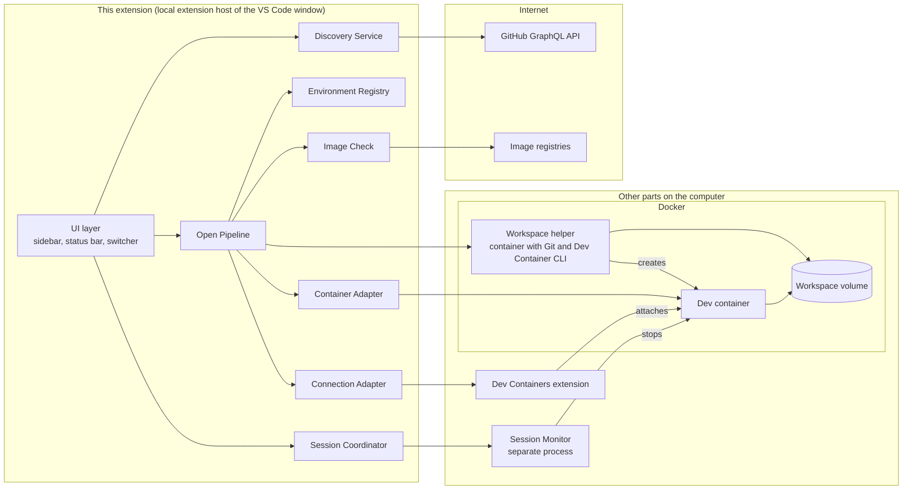
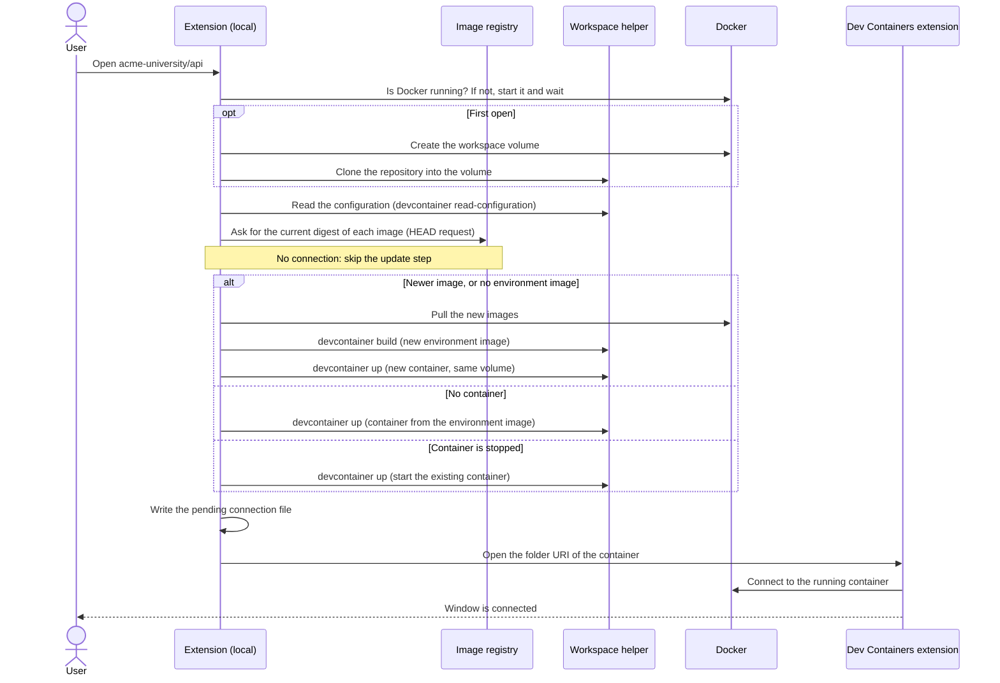
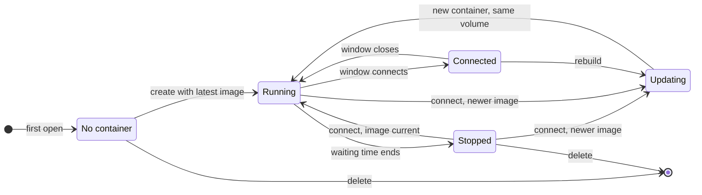

# Dev Environment Launcher — Concept

| Item | Value |
|---|---|
| Document type | Concept. This document contains no implementation. Code blocks show data structures and interfaces as illustration only. |
| Working title | Dev Environment Launcher (final name: see [D-1](#13-decisions)) |
| Product type | Visual Studio Code extension |
| Status | Draft for review |
| Date | 2026-09-24 |

## Contents

1. [Summary](#1-summary)
2. [Terms](#2-terms)
3. [Background](#3-background)
4. [Requirements](#4-requirements)
5. [Scope](#5-scope)
6. [User experience](#6-user-experience)
7. [Architecture](#7-architecture)
8. [Settings](#8-settings)
9. [Security and privacy](#9-security-and-privacy)
10. [Risks](#10-risks)
11. [Verification before implementation](#11-verification-before-implementation)
12. [Delivery phases](#12-delivery-phases)
13. [Decisions](#13-decisions)
14. [Alternatives considered](#14-alternatives-considered)
15. [References](#15-references)

---

## 1. Summary

The Dev Environment Launcher is an extension for Visual Studio Code (VS Code). It does three things:

1. It lists all GitHub repositories that the signed-in user can access and that contain a Dev Container configuration.
2. It opens a selected repository in a local dev container with one action.
3. It manages the environment for the user: it creates, updates, connects, switches, stops, and reopens environments automatically.

The user works only with this extension. The Dev Containers extension, Docker commands, and the Dev Container CLI are used internally and are not visible in the normal workflow.

Main behavior:

- **Open**: one action opens a repository in a dev container. This is the local equivalent of the GitHub action "Create codespace on main".
- **Docker start**: if Docker is not running, the extension starts it and waits until it is ready.
- **Latest image**: before each connection, the extension checks whether a newer version of the container image exists. It compares image digests, not tag names, so this also works for tags without a fixed version, such as `:latest`. If a newer image exists, the extension pulls it and rebuilds the container before it connects. Without internet access, the extension skips this update step and starts the environment with the local image.
- **Work is kept**: the repository is stored in a Docker volume that belongs to the environment. A rebuild creates a new container and mounts the same volume. Uncommitted changes and unpushed commits are kept.
- **Switch**: while connected, the user can switch to another environment in the same window.
- **Stop on close**: when the VS Code window closes, the extension stops the container of this window after a short waiting time. A stopped container has no running processes and uses no memory. The workspace volume is kept.
- **Reopen**: when VS Code starts again, the last environment starts and connects automatically.

## 2. Terms

| Term | Meaning in this document |
|---|---|
| Dev Container configuration | A `devcontainer.json` file in a repository, as defined by the [Dev Container specification](https://containers.dev/implementors/spec/) |
| Environment | One repository in one workspace volume, plus the dev container that is created from one of its configurations |
| Workspace volume | A named Docker volume that contains the Git clone of the repository. It exists independently of the container. |
| Dev Containers extension | The Microsoft extension `ms-vscode-remote.remote-containers`. It connects a VS Code window to a container. |
| Dev Container CLI | The open-source command-line tool [`@devcontainers/cli`](https://github.com/devcontainers/cli). It builds and starts dev containers. |
| Workspace helper | A short-lived helper container of this extension. It contains Git and the Dev Container CLI, and it works on the workspace volume. |
| Image digest | The content hash (`sha256:…`) of an image in a registry. A tag such as `:latest` can point to a new digest at any time. A digest never changes. |
| Environment image | The image that the extension builds for an environment from its configuration: the base image plus the Dev Container Features. Containers are created from this image, also without internet access. |
| Build record | The name of the current environment image, and the digests of the images and Features that it was built from |
| Stop | Stop a container with `docker stop`. Its processes end, and it frees its memory. The container and the workspace volume stay, so the next start takes only seconds. |
| Waiting time | The time between "no window uses the environment" and "the extension stops the container". Default: 30 seconds. |
| Session Monitor | A small helper process of this extension. It stops containers when no window uses them anymore. |
| Open pipeline | The fixed sequence of steps that the extension runs to open, reopen, update, or reconnect an environment |

## 3. Background

On GitHub, the repository page offers the action "Create codespace on main". It creates a cloud development environment from the Dev Container configuration of the repository with one click.

For organizations and enterprises, GitHub includes no free Codespaces usage. This also applies to GitHub Enterprise Cloud from the GitHub Campus Program. Every codespace that an organization pays for is billed from the first hour.

This extension offers the same one-action experience with local containers. It uses the same `devcontainer.json` files, so the repositories need no changes. Like a codespace, an environment keeps the repository in storage that is separate from the container.

## 4. Requirements

### 4.1 Functional requirements

| ID | Requirement |
|---|---|
| FR-01 | The extension lists all repositories that the signed-in user can access and that contain a Dev Container configuration. |
| FR-02 | One action opens a listed repository in a local dev container. If the repository has no environment, the action creates one on the default branch. If the repository has an environment, the action opens this environment (see [6.2](#62-sidebar-view)). |
| FR-03 | The user can select a branch. If a repository has several configurations, the user can select one. |
| FR-04 | No flow requires the user to use commands, views, or prompts of the Dev Containers extension. |
| FR-05 | While connected to an environment, the user can switch to another environment. |
| FR-06 | When a window closes, or when VS Code quits, the extension stops the container of that window. No process of the environment keeps running in the background, and the container uses no memory. |
| FR-07 | When VS Code starts, it reopens and connects the last used environment automatically. |
| FR-08 | Reconnection is automatic: the extension starts Docker if needed (FR-14), starts stopped containers, and creates missing containers again. |
| FR-09 | The user can rebuild and delete an environment. Before delete, the extension warns about uncommitted or unpushed changes. |
| FR-10 | The extension shows the state of each environment: connected, running, stopped. |
| FR-11 | Before each connection, the extension checks whether a newer version of each image of the configuration exists. If yes, it pulls the new image and rebuilds the container before it connects. The check also works for tags without a fixed version, such as `:latest`, and for images without a tag. |
| FR-12 | A rebuild always mounts the same workspace volume again. Uncommitted changes, unpushed commits, stashes, and untracked files are kept. |
| FR-13 | If an image registry cannot be reached, for example because no internet access is available, the extension skips the update step and starts the environment with the local images. The next connection checks again. |
| FR-14 | If Docker is not running, the extension starts it automatically and waits until it is ready. The user does not need to start Docker manually. |

### 4.2 Non-functional requirements

| ID | Requirement |
|---|---|
| NFR-01 | Ease of use: a new user reaches a running environment in three steps: sign in, select a repository, wait. |
| NFR-02 | Messages use plain language. Technical logs are shown only on request. |
| NFR-03 | The extension stores no secrets. GitHub access uses the built-in GitHub sign-in of VS Code. |
| NFR-04 | No container keeps running after a VS Code crash. A window reload and computer sleep do not stop a container that a window uses. |
| NFR-05 | Primary platform: macOS with Docker Desktop. Linux with Docker Engine is supported. Windows is supported with Docker Desktop and the WSL 2 back end. |
| NFR-06 | Internal details of the Dev Containers extension are used in one component only. A change in the Dev Containers extension affects only this component. |
| NFR-07 | Data safety: only the action **Delete** removes a workspace volume. An update never removes a working container before its replacement is ready. |
| NFR-08 | Without internet access, the update check delays the start of an environment by 5 seconds at most. |

## 5. Scope

**In scope for version 1:**

- Repositories on GitHub.com that the signed-in user can access: own repositories, repositories with collaborator access, and repositories of organizations where the user is a member (including GitHub Enterprise Cloud organizations).
- Local Docker: Docker Desktop (macOS, Windows, Linux) and Docker Engine (Linux).
- Configurations based on an image or a Dockerfile (phase 1), and on Docker Compose (phase 2, see [V-10](#11-verification-before-implementation)).
- Public and private images in registries that Docker can access with its stored credentials.

**Out of scope for version 1:**

- Search across all public repositories on GitHub.
- Remote Docker hosts and cloud machines.
- Other container runtimes, for example OrbStack, Colima, Rancher Desktop, and Podman (Podman is planned for phase 3).
- GitHub Enterprise Server.
- GitHub Codespaces.

**Known limits:**

- The first open of a repository needs internet access: for the clone, and for the download of the images.
- The repository is in a Docker volume, not in a folder on the computer. Other programs on the computer cannot open the files directly.
- Configurations that mount files of the repository from the computer (variable `${localWorkspaceFolder}`) do not work, because the repository is not in a folder on the computer.
- `initializeCommand` runs in the workspace helper, not directly on the computer (see [7.6](#76-open-pipeline)).
- Only data in the workspace volume survives a rebuild. Data in other folders of the container, for example the home folder, is lost, unless the configuration stores it in an additional named volume (property `mounts`).
- Work that runs in the container after its window has closed, for example a long build in a terminal, ends when the container stops.
- On Linux with Docker Engine, the extension cannot start the Docker service, because this needs administrator rights (see [7.6](#76-open-pipeline)).

## 6. User experience

### 6.1 First start

1. The extension adds an icon to the activity bar. Its view shows a short welcome text and one button: **Sign in with GitHub**. The sign-in uses the built-in GitHub authentication of VS Code.
2. The extension checks that Docker is installed. If not, it shows one message with a link to the download page of Docker Desktop. If Docker is installed but not running, the extension starts it later, when an environment needs it. Git on the computer is not needed, because the workspace helper contains Git.
3. The repository list loads. The first load can take some seconds. Later, the view shows the stored list at once and updates it in the background.

### 6.2 Sidebar view

The sidebar has two lists:

- **ENVIRONMENTS** lists the environments that exist on this computer. Each environment is a workspace volume with a clone of the repository, plus its dev container (see [section 2](#2-terms)). The first **Open** of a repository creates its environment. The environment stays until the user selects **Delete**. The list comes from the Environment Registry and from Docker (see [7.5](#75-environment-model-and-workspace-volume)), so it is complete also without internet access.
- **REPOSITORIES** lists the repositories on GitHub that the user can access and that contain a Dev Container configuration (FR-01). The list comes from GitHub (see [7.4](#74-repository-discovery)). A row is only a reference to GitHub. A repository has no environment on this computer until its first **Open**.

A repository that has an environment appears in both lists.

```text
DEV ENVIRONMENTS
▾ ENVIRONMENTS
    ● acme-university/api        main (python)       Connected
    ◐ acme-university/api        fix-login (node)    Running
    ○ acme-university/web        feature-x           Stopped · 2 hours ago · 3 unpushed
    ○ your-account/dotfiles      main                Stopped · 3 days ago
▾ REPOSITORIES                                            [Search] [Refresh]
  ▾ your-account
      dotfiles       1 environment                        [Open]  [⋯]
      website                                             [Open]  [⋯]
  ▾ acme-university
      api            2 configurations · 2 environments    [Open]  [⋯]
      docs                                                [Open]  [⋯]
      web            1 environment                        [Open]  [⋯]
```

**Environment row.** Each row shows the repository, the branch, the configuration if the repository has several, the state, and the changes:

- Branch: the branch that is checked out in the workspace volume. For a stopped environment, the row shows the last known branch from the registry (see [7.5](#75-environment-model-and-workspace-volume)).
- Configuration: if the repository has more than one configuration, the row shows the configuration in brackets after the branch. The name is the sub-folder of the configuration, for example `python` for `.devcontainer/python/devcontainer.json`, or `default` for `.devcontainer/devcontainer.json` and `.devcontainer.json`.
- Changes: an environment with uncommitted or unpushed changes shows this information, for example `3 unpushed`. The values are updated each time the extension stops the container (see [7.5](#75-environment-model-and-workspace-volume)).

States of an environment (see also [7.15](#715-environment-states)):

| Symbol | State text | Meaning |
|---|---|---|
| ● | Connected | This window is connected to the environment. |
| ● | Connected · other window | Another VS Code window is connected to the environment. **Open** shows that window (see [7.11](#711-switching)). |
| ◐ | Running | The container runs, but no window is connected to it, for example during the waiting time before a stop. |
| ○ | Stopped | The container is stopped. The next **Open** starts it. |
| ↻ | Updating | An update, a rebuild, or a delete is in progress. |
| ◌ | No container | The container was removed outside of the extension. The next **Open** creates it again from the environment image. |
| ⚠ | Files missing | The workspace volume is missing (see [7.12](#712-automatic-recovery)). |

**Repository row.** If environments exist for the repository, the row shows their number, for example `1 environment`. A row without this information has no environment yet. **Open** then clones the repository and prepares a new environment, which can take several minutes.

**Actions:**

- **Open** (button in a repository row): if the repository has no environment, **Open** creates one on the default branch. If the repository has environments, **Open** opens the most recently used one, on the branch that is checked out in it.
- **⋯** (menu of a repository): Open branch…, Open in new window, Show on GitHub.
- Menu of an environment: Open, Open in new window, Stop, Rebuild, Delete.

### 6.3 Status bar

One item on the left side of the status bar:

| State | Text | Click action |
|---|---|---|
| Connected | `$(vm) acme-university/api · main` | Opens the switcher |
| Not connected | `$(vm) Open environment…` | Opens the switcher |
| Busy | `$(sync~spin) Updating acme-university/api…` | Shows the progress details |
| Connection lost | `$(warning) Reconnect acme-university/api` | Runs the open pipeline again |

### 6.4 Switcher

Command **Dev Environments: Switch Environment…**. It is also available with a keyboard shortcut (proposal: `Ctrl+Alt+E`, on macOS `Cmd+Alt+E`). It shows a Quick Pick list:

1. Recent environments with their state (see [6.2](#62-sidebar-view)).
2. The entry **Open repository…**. It shows all discovered repositories with a text search.

The default action opens the selected environment in the current window. Each entry also has a button **Open in new window**.

### 6.5 Progress and errors

One notification shows the progress in plain steps. Steps that are not needed are skipped:

1. Starting Docker (only if Docker is not running)
2. Downloading repository (first open only)
3. Checking for a newer image
4. Downloading the new image (only if a newer image exists)
5. Preparing environment (first open, or after a new image; can take several minutes)
6. Starting environment
7. Connecting

If step 4 runs, the notification names the reason: "A newer image is available. The environment is updated. Your files are kept."

The notification has a button **Show details**. It opens the output channel of the extension with the complete log.

Messages name the situation and offer at most one action:

| Situation | Message | Action |
|---|---|---|
| Docker is not installed | Docker Desktop is not installed. | Open download page |
| Docker could not be started | Docker could not be started. | Show details, Try again |
| Build failed | The environment could not be prepared. | Show details, Try again |
| Registry not reachable, for example without internet access (information, not an error) | No connection to the image registry. The update check was skipped. The environment uses the local image. | None |
| First open without internet access | This repository cannot be opened without internet access. | Try again |
| Registry requires a sign-in | The registry ghcr.io requires a sign-in. | Sign in |
| No access to an organization | Access to the organization acme-university is not authorized. | Authorize |

### 6.6 Main flows

| Flow | User action | Result |
|---|---|---|
| Open | Select **Open** on a repository | The window connects to the environment. |
| Update | None (automatic at each connection) | If a newer image exists, the container is rebuilt with it before the window connects. The workspace volume is kept. |
| Open without internet access | Select **Open** on an environment | The update step is skipped. The environment starts with the local image. |
| Switch | Select another environment in the switcher | The same window connects to the other environment. The previous environment stops. |
| Close | Close the window, or quit VS Code | The environment stops after the waiting time (default: 30 seconds). |
| Reopen | Start VS Code | The last environment starts and connects. |
| Stop | Select **Stop** on an environment | The container stops at once. The workspace volume is kept. |
| Rebuild | Select **Rebuild** on an environment | The container is created again. The workspace volume is kept. |
| Delete | Select **Delete** on an environment | The container and the workspace volume are removed after a safety check. |

## 7. Architecture

### 7.1 Design principles

1. **The extension runs on the local machine.** It is a UI extension (`"extensionKind": ["ui"]`). VS Code runs it on the local machine in every window, also in windows that are connected to a container. So the extension always has access to the local Docker CLI and file system.
2. **The Dev Container CLI manages containers. The Dev Containers extension only connects.** The Dev Container CLI (npm package `@devcontainers/cli`, MIT license) builds, creates, and starts the containers, so the extension controls progress, logs, and errors. The Dev Containers extension is used only to connect a window to a container that is already running.
3. **The repository is stored in a workspace volume.** Each environment has one named Docker volume. The container can be replaced at any time: update, rebuild, and stop never change the volume. Only **Delete** removes it, after a safety check. On macOS and Windows, a named volume is also faster than a folder that is shared from the computer, because Docker runs the containers in a virtual machine there.
4. **The latest image at each connection.** The extension compares image digests, not tag names (see [7.7](#77-image-update-check)). Without internet access, it skips this step.
5. **Build and container creation are separate steps.** The extension first builds an environment image and then creates the container from it. So a new container needs no download, and an update never removes a working container before the new environment image is ready.
6. **No container runs without a window.** When no window uses an environment, the extension stops its container (see [7.9](#79-stop-on-close-and-crash-handling)).
7. **One open pipeline for all flows.** Open, reopen, switch, update, and reconnect run the same steps. Each step checks the current state first and does nothing if its result exists already. So the pipeline can run again at any time without side effects.
8. **Internal details in one place.** The format of the folder URI and the command IDs of the Dev Containers extension are not public API. Only the Connection Adapter uses them.

### 7.2 Components



| Component | Responsibility |
|---|---|
| UI layer | Tree views, status bar item, switcher (Quick Pick), welcome views, progress notifications |
| Discovery Service | Finds repositories with Dev Container configurations through the GitHub GraphQL API. Stores the result. |
| Environment Registry | Stores the list of environments, their build records, and their last known Git state in a JSON file in the global storage of the extension |
| Open Pipeline | Runs the steps of [7.6](#76-open-pipeline). Handles errors and repeats. |
| Image Check | Finds the images of a configuration, compares their digests with the registry, and pulls new images |
| Workspace helper | Short-lived container with Git, Node.js, the Docker CLI, and the Dev Container CLI. It mounts the workspace volume and has access to Docker. It clones the repository, reads the configuration, runs `devcontainer build` and `devcontainer up`, and runs the Git safety check. |
| Container Adapter | Docker CLI calls on the computer: check and start Docker, find containers, images, and volumes by label, stop, remove |
| Connection Adapter | Creates the folder URI for the Dev Containers extension, opens it, and finds out which environment the current window uses |
| Session Coordinator | Writes the window status file, the pending connection file, and the reopen record. Starts the Session Monitor. |
| Session Monitor | Separate helper process. Stops containers that no window uses anymore. Ends itself when it has no work. |

### 7.3 Extension manifest decisions

| Manifest field | Value | Reason |
|---|---|---|
| `extensionKind` | `["ui"]` | The extension runs locally in every window (see [7.1](#71-design-principles)). |
| `extensionDependencies` | `["ms-vscode-remote.remote-containers"]` | VS Code installs the Dev Containers extension automatically. |
| `activationEvents` | `onStartupFinished`, `onResolveRemoteAuthority:attached-container` | Every window must write its status file (see [7.9](#79-stop-on-close-and-crash-handling)). The second event activates the extension before VS Code connects a restored window, so that the extension can start Docker, check the image, and start the stopped container first (see [7.10](#710-reopen-last-environment); to verify in [V-2](#11-verification-before-implementation)). |
| `contributes.viewsContainers`, `contributes.views` | One activity bar icon, two views | Sidebar (see [6.2](#62-sidebar-view)) |
| `contributes.commands`, `contributes.keybindings`, `contributes.menus` | Open, Switch, Stop, Rebuild, Delete, Refresh | Command Palette, switcher, menus |
| `contributes.configuration` | Settings of section [8](#8-settings) | |

### 7.4 Repository discovery

The Discovery Service uses the GitHub GraphQL API. One request returns up to 50 repositories. The same request checks whether each repository contains a Dev Container configuration.

Illustration of the query (not final; argument details to verify in [V-5](#11-verification-before-implementation)):

```graphql
query Discover($cursor: String) {
  viewer {
    repositories(
      first: 50
      after: $cursor
      affiliations: [OWNER, COLLABORATOR, ORGANIZATION_MEMBER]
      ownerAffiliations: [OWNER, COLLABORATOR, ORGANIZATION_MEMBER]
      orderBy: { field: PUSHED_AT, direction: DESC }
    ) {
      pageInfo { hasNextPage endCursor }
      nodes {
        id
        nameWithOwner
        url
        isArchived
        isFork
        pushedAt
        defaultBranchRef { name }
        rootFile: object(expression: "HEAD:.devcontainer.json") { __typename }
        folder: object(expression: "HEAD:.devcontainer") {
          ... on Tree {
            entries {
              name
              type
              object { ... on Tree { entries { name } } }
            }
          }
        }
      }
    }
  }
}
```

The detection rules follow the [file locations of the Dev Container specification](https://containers.dev/implementors/spec/#devcontainerjson), in its order of precedence:

| Found in the query result | Configuration path |
|---|---|
| `folder` contains the file `devcontainer.json` | `.devcontainer/devcontainer.json` |
| `rootFile` exists | `.devcontainer.json` |
| A sub-folder of `folder` contains `devcontainer.json` | `.devcontainer/<sub-folder>/devcontainer.json` |

Further rules:

- If a repository contains several configurations, the first one in this order is the default. The user can select another one (FR-03).
- `HEAD` is the default branch. When the user selects another branch, the extension checks the configuration of that branch at that moment.
- The result is stored in the global storage of the extension. The view shows the stored list at once. It updates the list in the background: at start, every 60 minutes, and when the user selects **Refresh**. Without internet access, the view shows the stored list and skips the update.
- An organization can restrict access for OAuth apps, or require SAML single sign-on authorization. In this case, the API returns errors for the repositories of this organization. The view shows one hint per organization with a link to authorize. An organization owner may need to approve the OAuth app that VS Code uses for the GitHub sign-in.
- Internal repositories of other organizations in the same enterprise are possibly not included in this query. See [V-5](#11-verification-before-implementation).

### 7.5 Environment model and workspace volume

The Environment Registry is a JSON file in the global storage of the extension. Example entry:

```json
{
  "id": "3f2a9c1e-5b7d-4e8a-9c0f-2d1e6a7b8c9d",
  "repository": "acme-university/api",
  "configPath": ".devcontainer/python/devcontainer.json",
  "volumeName": "devenv-acme-university-api-3f2a9c1e",
  "containerName": "devenv-acme-university-api-3f2a9c1e",
  "createdAt": "2026-09-24T15:40:00Z",
  "lastUsedAt": "2026-09-24T17:10:00Z",
  "gitSummary": {
    "branch": "main",
    "uncommittedFiles": 0,
    "unpushedCommits": 0,
    "recordedAt": "2026-09-24T17:10:00Z"
  },
  "buildRecord": {
    "builtAt": "2026-09-24T15:44:00Z",
    "environmentImage": "devenv-3f2a9c1e:2",
    "configHash": "sha256:7d0f…",
    "images": {
      "mcr.microsoft.com/devcontainers/python:3.12": "sha256:4b1e…"
    },
    "features": {
      "ghcr.io/devcontainers/features/node:1": "sha256:9a2c…"
    }
  }
}
```

**Workspace volume:**

- The extension creates one named volume per environment. The volume has the labels `devenv.environment-id` and `devenv.repository`.
- In the dev container, the volume is mounted at `/workspaces`. The repository is in `/workspaces/<repository name>`.
- The volume contains the complete Git clone: the working tree, the `.git` folder with local branches and stashes, and untracked files.
- An update or a rebuild removes only the container. The new container mounts the same volume. The extension never uses a different volume name for an existing environment.
- If the volume is missing (for example after a reset of Docker Desktop), the extension does not create an empty volume silently. It shows a message and offers to clone the repository again.

**Rules:**

- The registry does not store container IDs. The container has the label `devenv.environment-id`. The extension sets this label with the CLI option `--id-label`, and the CLI uses the same label to find the existing container.
- The container name is stable (see [7.6](#76-open-pipeline)). So a window that VS Code restores finds the container also after an update.
- The registry stores the last known branch and the numbers of uncommitted files and unpushed commits (`gitSummary`). So the sidebar can show a stopped environment without starting Docker and without a helper container (see [6.2](#62-sidebar-view)). These values are updated before each stop of the container: by the Session Monitor (see [7.9](#79-stop-on-close-and-crash-handling)), and by the action **Stop**. If the container stops in another way, for example when Docker stops, the values of the previous record stay. While the container runs, the extension reads the current branch from the container (`git branch --show-current` through `docker exec`).
- If the registry is lost, the extension can rebuild the list of environments from the labels of the volumes. The build records are then missing, so the next connection with internet access rebuilds the container.
- Default: one environment per repository. If the user selects **Open branch…** for a repository that has an environment already, the extension asks: switch the branch in the existing environment, or create a second environment. A second environment has its own volume.

### 7.6 Open pipeline



If the container runs already (for example during the waiting time after a close), no start is necessary.

**Docker start.** Before each step that needs Docker, the extension checks with `docker info` whether Docker runs. If it does not run, the extension starts it and repeats `docker info` until it succeeds, for at most 2 minutes. The progress notification shows "Starting Docker". The user does not need to start Docker.

| Platform | How the extension starts Docker |
|---|---|
| Docker Desktop on macOS, Windows, or Linux | `docker desktop start` (Docker Desktop CLI). If the installed version does not have this command: on macOS `open -g -a Docker`, on Windows the program `Docker Desktop.exe` from its installation folder. |
| Docker Engine on Linux | The Docker service needs administrator rights to start (`sudo systemctl start docker`). The extension cannot enter a password, so it shows this command in a message. Normally, the service starts with the computer. |

Further rules for the Docker start:

- The extension starts Docker only when an environment needs it, not at each start of VS Code.
- If the Resource Saver mode of Docker Desktop has stopped the Docker engine, the next Docker command starts the engine again. The extension waits in the same way.
- The Session Monitor never starts Docker. When Docker does not run, no container runs.

**Workspace helper.** The helper is a small container image with Git, Node.js, the Docker CLI, and the Dev Container CLI. The extension builds this image locally from a Dockerfile that is part of the extension, at first use and after an extension update. Each helper run is a new container that is removed at the end (`docker run --rm`). The helper mounts the workspace volume and the Docker socket. So the CLI in the helper can read the build context from the volume and send it to Docker. The helper also mounts a cache volume for the CLI, so that Features that were downloaded once are available without internet access (to verify in [V-10](#11-verification-before-implementation)).

**Environment image.** The extension separates the build from the creation of the container:

1. `devcontainer build` builds the environment image from the repository configuration in the volume: the base image plus the Features. The image name contains the environment ID and a build number, for example `devenv-3f2a9c1e:2`. The CLI stores the configuration in the label `devcontainer.metadata` of the image. The prebuild guide of the Dev Container specification says about such images: "This makes the image self-contained since these settings are automatically picked up when the image is referenced."
2. `devcontainer up` creates the container from this image. This step needs no build and no download, so it works also without internet access.

**Override configuration for `devcontainer up`.** The extension generates an override configuration (CLI option `--override-config`). It contains only the properties that are not stored in the image metadata, so that no setting and no lifecycle command exists twice:

| Property | Value | Reason |
|---|---|---|
| `image` | The environment image, for example `devenv-3f2a9c1e:2` | Create the container without a build |
| `workspaceMount` | `source=<volume name>,target=/workspaces,type=volume` | Mount the workspace volume |
| `workspaceFolder` | `/workspaces/<repository name>` | Open the repository folder |
| `runArgs` | The values of the repository configuration, plus `--name <container name>` | Stable container name |
| `appPort` | The value of the repository configuration | Not stored in the image metadata |
| `shutdownAction` | `none` | Only the Session Monitor stops the container (see [7.9](#79-stop-on-close-and-crash-handling)). This value replaces the value from the image metadata. |

The VS Code documentation describes the same `workspaceMount` pattern to store the entire source tree in a named volume. The repository itself is not changed.

**Further notes:**

- Other CLI options: `--id-label devenv.environment-id=<id>` (find the container again), and `--remove-existing-container` when the container is replaced.
- Variables: the extension resolves `${localEnv:…}` variables with the values of the computer, in the override configuration or as environment variables of the helper container. Otherwise, the CLI in the helper would use the values of the helper container.
- `initializeCommand`: the specification runs this command on the host of the tool. Here, this host is the workspace helper, not the computer of the user.
- Clone: the helper clones with the token of the VS Code GitHub session. The token is available only during the clone, as a temporary file in memory (tmpfs mount). It is not stored in the volume, in `.git/config`, or on the command line. The remote URL of the clone contains no token.
- `devcontainer up` returns a JSON result with `containerId` and `remoteWorkspaceFolder`. The extension uses `remoteWorkspaceFolder` for the folder URI.
- A stopped container starts through `devcontainer up`, which runs `postStartCommand` as usual. `onCreateCommand` and `postCreateCommand` run only when a new container is created.
- The extension never opens a folder of the repository locally. So the "Reopen in Container" notification of the Dev Containers extension does not appear.
- The pending connection file prevents a stop while the window connects (see [7.9](#79-stop-on-close-and-crash-handling)).

### 7.7 Image update check

The Image Check runs in each open pipeline, before the container is started or created.

**Checked images:**

| Source in the configuration | Checked image references |
|---|---|
| `image` | The image reference |
| `build.dockerfile` | Every `FROM` image of the Dockerfile, except references to earlier build stages. `ARG` values come from `build.args` and from the `ARG` defaults in the Dockerfile. |
| `features` | Each Feature reference. Features are published as OCI artifacts and have digests like images (see [D-7](#13-decisions)). |

**Check steps:**

1. For each reference, the extension asks the registry for the current digest of the tag. This is an HTTP `HEAD` request to the manifest endpoint, as defined by the [OCI Distribution Specification](https://github.com/opencontainers/distribution-spec/blob/main/spec.md). The response header `Docker-Content-Digest` contains the digest.
2. The extension compares this digest with the digest in the build record of the current environment image (see [7.5](#75-environment-model-and-workspace-volume)).
3. If all digests are equal, the environment image is up to date.
4. If at least one digest differs, the extension runs the update (see "Update order" below).

The comparison uses the build record, not the local image. The reason: another environment can have pulled the new image already. Then the local image is new, but the environment image of this environment was built from the old one.

**Tags without a fixed version.** The check does not use the tag name. It asks the registry which digest the tag points to now. So it works in the same way for:

- tags without a fixed version, such as `:latest`,
- references without a tag (Docker uses `latest` in this case),
- version tags that the publisher moves to a new build, for example a tag such as `:3.12` that receives security updates.

A reference with a digest (`@sha256:…`) never changes. The extension does not check it.

**Update order.** An update never removes the working container before the new environment image is ready:

1. Pull the new images.
2. Build the new environment image (`devcontainer build`).
3. Replace the container: `devcontainer up --remove-existing-container`, with the new environment image and the same workspace volume.
4. Write the new build record, and remove the old environment image.

If step 1 or step 2 fails, for example because the internet connection ends during the download, the old container and the old environment image stay unchanged, and the environment starts with them. The next connection tries the update again.

**Without internet access.** The update step needs the image registries. If at least one registry cannot be reached, the extension skips the complete update step for this connection and continues with what exists locally:

| Local state | Result without internet access |
|---|---|
| The container exists | The extension starts the existing container. |
| No container, but the environment image exists (for example after `docker system prune`) | The extension creates the container from the environment image. |
| No environment image (first open, or the image was removed) | The environment cannot be prepared. The extension shows a message (see [6.5](#65-progress-and-errors)). |

Rules:

- A registry counts as not reachable if the name resolution fails, the connection fails, or no valid answer arrives in time. Without internet access, the name resolution normally fails at once.
- All digest requests of one connection run in parallel, with one common time limit of 5 seconds. So the check delays the start by 5 seconds at most.
- The digest requests use the proxy settings of VS Code.
- The extension shows an information message, not an error: "No connection to the image registry. The update check was skipped. The environment uses the local image." The message does not stop the start.
- The next connection checks again. The extension does not check in the background while a window is connected.

**Special cases:**

| Situation | Behavior |
|---|---|
| No build record (first open, or registry lost) | Pull the images and build the environment image. |
| Registry requires a sign-in | The extension uses the credentials that Docker uses (Docker credential helper). For private images on ghcr.io, it can use the VS Code GitHub session with the additional scope `read:packages`. |
| Setting `devEnvLauncher.updateImagesOnConnect` is `false` | No check. |

**Registry limits.** The Docker documentation says about Docker Hub: "Using GET emulates a real pull and counts towards the limit. Using HEAD won't." So the check at each connection does not use up the pull limit of Docker Hub. The extension pulls an image only when its digest has changed.

**Disk space.** After a successful update, the extension removes the old environment image. It also removes base images that no environment image uses anymore.

### 7.8 Connection to the container

The Dev Containers extension can attach a window to a running container. The extension uses this function with a folder URI that has the scheme `vscode-remote` and an authority that starts with `attached-container+`. The rest of the authority is a hexadecimal encoding of a JSON object with the container name. The path of the URI is the workspace folder inside the container.

```text
vscode-remote://attached-container+<hex(JSON)>/<remoteWorkspaceFolder>

JSON (format to confirm in V-2):
{ "containerName": "/devenv-acme-university-api-3f2a9c1e" }
```

- Open: VS Code command `vscode.openFolder` with this URI. Option `forceNewWindow: false` opens it in the current window, `true` in a new window.
- Configuration: the container has the configuration in the label `devcontainer.metadata`, from the environment image. When the Dev Containers extension attaches, it applies this configuration: VS Code extensions, settings, `remoteUser`, `forwardPorts`, and `postAttachCommand` (to verify in [V-1](#11-verification-before-implementation)).
- Detect the environment of the current window: `vscode.env.remoteName` is `attached-container`, and the container name in the authority matches an environment of the registry.
- This format is not a public API of the Dev Containers extension. Only the Connection Adapter creates or reads it (see [RK-1](#10-risks)).

### 7.9 Stop on close and crash handling

Three facts make this requirement difficult:

1. When a window closes, VS Code calls the `deactivate()` function of the extension, but it gives the function only little time.
2. When VS Code crashes or is terminated, VS Code does not call `deactivate()`.
3. A window reload also calls `deactivate()`. In this case, the container must continue to run.

Solution: each window reports its state in a status file, and a separate helper process, the Session Monitor, decides when a container stops.

**Window status file.** Each window writes its status file at activation and then every 15 seconds:

`<global storage>/sessions/<window-id>.json`

```json
{
  "windowId": "b7c1d2e3-0000-4000-8000-000000000001",
  "pid": 48213,
  "environmentId": "3f2a9c1e-5b7d-4e8a-9c0f-2d1e6a7b8c9d",
  "state": "active",
  "updatedAt": "2026-09-24T17:40:15Z"
}
```

- `windowId` is a random ID that the extension creates at activation. A window reload creates a new ID.
- `pid` is the process ID of the local extension host of the window. This process ends when the window closes or crashes.
- `environmentId` is `null` for a window that is not connected to an environment.
- In `deactivate()`, the window changes `state` to `closing` with a synchronous file write. This takes only milliseconds.

**Pending connection file.** Before the open pipeline opens the folder URI, it writes the file `<global storage>/pending/<environment-id>.json` with the current time. The window that connects deletes this file when it writes its status file. The file prevents a stop between "container is running" and "window is connected".

**Session Monitor.** The Session Monitor is a small Node.js script that is part of the extension. The extension starts it as a separate, detached process with the Node.js runtime of VS Code (environment variable `ELECTRON_RUN_AS_NODE=1`). No separate Node.js installation is needed. Only one Session Monitor runs at a time (lock file with the process ID). After VS Code has closed, it continues to run only until the last waiting time has ended.

Every 5 seconds, the Session Monitor applies two rules to each environment of the registry:

- **Rule 1, in use.** An environment is in use if at least one of these conditions is true:
  - A window status file references the environment, its state is `active`, its process exists, and its `updatedAt` is not older than 60 seconds.
  - A pending connection file for the environment exists and is not older than 2 minutes.
  - The registry marks the environment as `busy` (update, rebuild, or delete in progress).
- **Rule 2, stop.** If the container of an environment runs and the environment is not in use, the Session Monitor waits for the waiting time. If the environment is still not in use at the end, the Session Monitor stops the container with `docker stop`.

Results for typical situations:

| Situation | What the Session Monitor sees | Result |
|---|---|---|
| Window closed, or VS Code quit | State `closing`, process ended | Stop after the waiting time |
| Switch to another environment in the same window | The old environment is no longer referenced. The new environment has a pending connection file. | The old environment stops after the waiting time. |
| Window reload | For some seconds, no window references the environment. Then the reloaded window writes a new status file. | No stop, if the reload takes less than the waiting time |
| VS Code crash or forced termination | Process ended, no `closing` state | Stop after the waiting time |
| Extension host does not respond | `updatedAt` older than 60 seconds | Stop after the waiting time |
| Computer sleep | After wake, all `updatedAt` values are old. | No stop. After a gap in its own checks, the Session Monitor ignores the age of `updatedAt` for 60 seconds, so that the windows can update their files. |
| Computer shutdown or Docker restart | Docker stops all containers. | The next connection starts them. |
| Update, rebuild, or delete in progress | Environment marked as `busy` | No stop |

Further rules:

- The Session Monitor stops only containers of environments in the registry. It does not change other containers.
- The Container Adapter checks the container state before each action.
- Before it stops a container, the Session Monitor records the current branch and the numbers of uncommitted files and unpushed commits in the registry (`gitSummary`, see [7.5](#75-environment-model-and-workspace-volume)). It runs Git in the container, if Git is available there. The sidebar shows these values (see [6.2](#62-sidebar-view)).
- It deletes the status files of ended processes after the waiting time.
- It ends itself when no VS Code window is alive and no waiting time is running.
- When the extension activates, it starts the Session Monitor if none runs. So a container that kept running without a window after an earlier failure stops at the next start of VS Code.

**Why `docker stop`.** A stopped container has no running processes and uses no memory. The container itself is kept, so the next start takes only seconds and needs no rebuild. Docker first sends a stop signal (default `SIGTERM`) to the main process of the container, and after 10 seconds `SIGKILL`, so programs in the container can end cleanly. At the next start, `postStartCommand` runs again, for example to start a development server. When no container runs, the Resource Saver mode of Docker Desktop stops the Docker engine after 5 minutes (default). This also reduces the memory use of Docker Desktop itself. The alternative `docker pause` keeps the processes and their memory (see [D-4](#13-decisions)).

**Relation to `shutdownAction`.** The Dev Container specification defines the property `shutdownAction`. It tells supporting tools whether to stop the containers when the related tool window is closed. The override configuration sets `"shutdownAction": "none"` (see [7.6](#76-open-pipeline)). So the Dev Containers extension does not stop the container, and only the Session Monitor decides when a container stops. This keeps one owner for the stop and makes the waiting time work for window reloads. If the repository configuration itself contains `"shutdownAction": "none"`, the setting `devEnvLauncher.respectShutdownActionNone` decides whether the container keeps running after close.

### 7.10 Reopen last environment

Two mechanisms work together:

1. **Window restore of VS Code.** At start, VS Code restores the windows of the last session (setting `window.restoreWindows`, default `all`). A restored window attaches again to its container. At this time, Docker possibly does not run, and the container is normally stopped. Therefore, the extension also activates on `onResolveRemoteAuthority:attached-container`, before VS Code connects. During activation, it starts Docker if needed and runs the image check. If the image is current, or if no registry can be reached, it starts the container through `devcontainer up`. If a newer image exists, it updates the environment first, with its own progress notification. Then VS Code connects. This must be verified in [V-2](#11-verification-before-implementation). If it does not work, the extension starts the old container, VS Code connects, and then the extension runs the update: close the remote connection, update, and connect again.
2. **Empty window at start.** VS Code does not always restore the window. Example on macOS: the user closes the last window, and VS Code continues to run without a window. Later, VS Code opens a new, empty window. In this case, the extension opens the last used environment itself, if all of these conditions are true:
   - The setting `devEnvLauncher.reopenLastOnStartup` is `true` (default).
   - The window is empty (no folder is open).
   - No other VS Code window is alive (no other status file with an existing process).
   - No operation is pending, for example a rebuild (see [7.14](#714-rebuild-and-delete)).
   - A reopen record exists, and it is older than 30 seconds.

   A notification "Opening acme-university/api… [Cancel]" lets the user stay in the empty window.

**Reopen record.** Each window that is connected to an environment writes the reopen record in `deactivate()`, together with the state `closing`:

```json
{ "environmentId": "3f2a9c1e-5b7d-4e8a-9c0f-2d1e6a7b8c9d", "closedAt": "2026-09-24T18:02:11Z" }
```

The age condition has a reason. The VS Code command **Close Remote Connection** also changes a window to an empty window. The extension then activates again within a few seconds, and the reopen record is younger than 30 seconds. So the extension does not reconnect a window that the user disconnected on purpose. The reopen rule is decision [D-5](#13-decisions).

### 7.11 Switching

1. The user selects another environment in the status bar, the switcher, or the sidebar.
2. The extension runs the open pipeline for the target environment until the container runs, including the image check. The current window stays connected during this time and shows the progress.
3. The extension replaces the folder of the current window with the folder URI of the target environment (`vscode.openFolder` with `forceNewWindow: false`). VS Code asks about unsaved files in the usual way.
4. The Session Monitor stops the previous environment after the waiting time (see [7.9](#79-stop-on-close-and-crash-handling)).

If the target environment is open in another window already, VS Code shows that window instead of opening it a second time (to verify in [V-2](#11-verification-before-implementation)).

### 7.12 Automatic recovery

| Situation | Automatic action |
|---|---|
| Docker is not running | Start Docker and wait until it is ready, for at most 2 minutes (see [7.6](#76-open-pipeline)). |
| Container is stopped | `devcontainer up` starts it. |
| Container was removed (for example by `docker system prune`, which removes stopped containers) | The extension creates the container again from the environment image, with the same workspace volume. No work is lost, and no internet access is needed. |
| Environment image was removed | The extension builds it again. This needs internet access, unless all images and Features are available locally. |
| Registry not reachable | Skip the update step and use the local images (see [7.7](#77-image-update-check)). |
| Workspace volume is missing | Message: "The files of this environment are missing." Actions: Clone again, Delete environment. The extension never creates an empty volume without asking. |
| `devcontainer.json` changed (for example after `git pull`) | At the next connection, the extension compares the configuration with the `configHash` of the build record. Message: "The environment configuration changed. [Rebuild now] [Later]" |
| Connection lost (for example after a Docker restart) | Status bar shows **Reconnect**. One click runs the open pipeline. |

### 7.13 Hiding the Dev Containers extension

**Measures of the extension:**

| Measure | Effect |
|---|---|
| `extensionDependencies` declares the Dev Containers extension | The user does not install it manually. |
| Build and start run through the Dev Container CLI in the workspace helper, with own progress and own log | The build progress and log of the Dev Containers extension do not appear. |
| The window attaches to a running container | The Dev Containers extension does not build and does not ask which configuration to use. |
| The extension never opens a repository folder locally | No "Reopen in Container" notification appears. |
| `"shutdownAction": "none"` in the override configuration | The Dev Containers extension does not stop containers. Only the extension decides when a container stops. |
| Profile template | A VS Code profile with recommended settings. A profile also stores the UI layout, for example hidden views such as Remote Explorer. Profiles can be exported to a `.code-profile` file and imported. Which settings and layout parts the exported file contains is part of [V-6](#11-verification-before-implementation). |

**Limits of the VS Code extension API:**

- An extension cannot remove or disable commands, views, status bar items, or notifications of another extension. The commands of the Dev Containers extension stay in the Command Palette.
- The remote indicator at the left end of the status bar belongs to VS Code and stays visible. For an attached window, it shows the container.
- While a window connects, the Dev Containers extension can show short notifications of its own, for example when a connection is lost.
- The Dev Containers extension is licensed for Microsoft Visual Studio Code, not for other builds such as VSCodium. So this extension targets Microsoft Visual Studio Code only (check the license terms of the Dev Containers extension).

### 7.14 Rebuild and delete

**Rebuild** (manual, or automatic after a new image):

1. The extension marks the environment as `busy` in the registry, so the Session Monitor does not stop it.
2. It records a pending operation (`rebuild`, environment ID) in the global storage.
3. If a window is connected, the extension closes the remote connection (VS Code command **Close Remote Connection**). The window becomes an empty local window, and the extension activates again in this window.
4. At activation, the extension finds the pending operation. It runs the update order of [7.7](#77-image-update-check), with its own progress: it builds a new environment image, and then replaces the container with `devcontainer up --remove-existing-container`. The new container mounts the same workspace volume.
5. It writes the new build record, connects the window again, and removes the `busy` mark.

A manual rebuild builds the environment image again, also when no digest has changed. It needs internet access if images or Features must be downloaded. If the build fails, the old container stays.

After a rebuild:

- **Kept:** all files in the workspace volume: uncommitted changes, unpushed commits, local branches, stashes, and untracked files. Additional named volumes of the configuration (`mounts`) are also kept.
- **Lost:** data in other folders of the old container. Running processes end.

**Delete:**

1. Safety check in the workspace volume, through the workspace helper: uncommitted changes (`git status`), unpushed commits, and stashes. If one of them exists, a dialog shows the numbers and offers: Open environment, Delete anyway, Cancel.
2. If a window is connected to the environment, the extension closes the remote connection first.
3. The extension removes the container and the environment image. It also removes base images that no other environment image uses.
4. It removes the workspace volume. Additional named volumes of the configuration (for example for a database) are removed only if the user confirms it.
5. It removes the registry entry.

### 7.15 Environment states



At the first open, the extension creates the workspace volume and clones the repository into it. When the waiting time ends, the Session Monitor stops the container with `docker stop`. Without internet access, the transitions "connect, newer image" do not happen, because the update step is skipped. The action **Delete** is possible in every state. If the environment is connected or running, the extension first closes the connection. The state `No container` also covers the case that the container was removed outside of the extension.

## 8. Settings

The prefix `devEnvLauncher` is a working name (see [D-1](#13-decisions)).

| Setting | Default | Description |
|---|---|---|
| `devEnvLauncher.reopenLastOnStartup` | `true` | Open the last used environment when VS Code starts (see [7.10](#710-reopen-last-environment)) |
| `devEnvLauncher.stopOnClose` | `true` | Stop the environment when no window uses it (see [7.9](#79-stop-on-close-and-crash-handling)). If `false`, the container keeps running. |
| `devEnvLauncher.waitingTimeSeconds` | `30` | Waiting time before a stop. It prevents a stop during a window reload. [V-4](#11-verification-before-implementation) measures the reload time to confirm the value. |
| `devEnvLauncher.updateImagesOnConnect` | `true` | Check for newer images at each connection (see [7.7](#77-image-update-check)) |
| `devEnvLauncher.respectShutdownActionNone` | `false` | If `true`, a repository with `"shutdownAction": "none"` keeps its container running after close |
| `devEnvLauncher.owners` | `[]` | Show only repositories of these accounts or organizations. An empty list shows all. |
| `devEnvLauncher.includeArchived` | `false` | Show archived repositories |
| `devEnvLauncher.includeForks` | `true` | Show forked repositories |
| `devEnvLauncher.refreshIntervalMinutes` | `60` | Interval of the background update of the repository list |

The Docker start (FR-14) has no setting, because it is a fixed requirement.

## 9. Security and privacy

- **GitHub access.** The extension calls `vscode.authentication.getSession("github", ["repo", "read:org"], { createIfNone: true })`. The scope `repo` is necessary to list and clone private repositories. The scope `read:org` is necessary to read organization memberships. The extension requests the scope `read:packages` only when a private image on ghcr.io needs it. VS Code stores the session. The extension does not store the token.
- **Clone.** The token is available in the workspace helper only during the clone, as a temporary file in memory (see [7.6](#76-open-pipeline)).
- **Git inside the container.** Git uses the credential forwarding of the Dev Containers extension. This must work for attached containers without additional setup (to verify in [V-8](#11-verification-before-implementation)).
- **Workspace helper.** The helper has access to the Docker socket, so it has full control over Docker. The extension builds the helper image locally from a Dockerfile that is part of the extension, and removes each helper container after its run. The `initializeCommand` of a repository also runs in the helper, so it also has access to Docker.
- **Docker start.** The extension starts Docker only with the documented commands of Docker Desktop. It never asks for an administrator password.
- **Code execution.** Opening a repository in a container runs code from the repository: the Dockerfile, Dev Container Features, and lifecycle commands. A container is not a strong security boundary. Therefore, the first open of a repository that does not belong to the user or to one of the user's organizations requires a confirmation.
- **Registry credentials.** The Image Check reads registry credentials through the Docker credential helper, only for the registry of the image. It does not store them.
- **Stored data.** The repository list and the registry contain metadata only: repository names, URLs, dates, volume names, image names, image digests, branch names, and numbers of changes.
- **Telemetry.** Version 1 collects no telemetry.

## 10. Risks

| ID | Risk | Impact | Mitigation |
|---|---|---|---|
| RK-1 | The `attached-container+` URI format is internal to the Dev Containers extension and can change. | The connection fails after an update of the Dev Containers extension. | Only the Connection Adapter uses the format. Automated test against new versions of the Dev Containers extension. Fallback: the command **Dev Containers: Attach to Running Container…**, with one extra selection by the user. |
| RK-2 | The Dev Containers extension does not apply the configuration from the container label when it attaches. | VS Code extensions or settings are missing in the container. | [V-1](#11-verification-before-implementation). Fallback: the extension writes an attached container configuration file (a documented function of the Dev Containers extension) from the merged configuration. |
| RK-3 | `deactivate()` does not run, or has too little time. | A container keeps running. | Session Monitor: process check, time limit, and check at each start of VS Code |
| RK-4 | The Session Monitor runs with the VS Code executable. On Windows, this can delay a VS Code update. | The update waits until the Session Monitor ends. | The Session Monitor ends when it has no work. To verify in [V-3](#11-verification-before-implementation). |
| RK-5 | A reset of Docker Desktop, or the function **Clean / Purge data** of Docker Desktop, deletes all volumes. | Uncommitted and unpushed work is lost. | The sidebar shows environments with unpushed changes. Phase 3: optional backup of unpushed work to a folder on the computer. |
| RK-6 | Organization access restrictions (SAML single sign-on, OAuth app policy) | Repositories are missing in the list. | Hint per organization with a link to authorize |
| RK-7 | The Session Monitor stops a container that a window still uses, for example after a slow reload or after computer sleep. | The window loses the connection. | Waiting time, pending connection file, sleep rule. Status bar action **Reconnect**. |
| RK-8 | Wrong digest comparison, for example for images with several architectures, or with the containerd image store of Docker | Missed updates, or updates without need | Compare with the build record, not with the local image. Test in [V-9](#11-verification-before-implementation). |
| RK-9 | An image changes often, for example a `:latest` tag with a new build every day. | Many connections include an update and take longer. | Clear progress message. Setting `devEnvLauncher.updateImagesOnConnect`. |
| RK-10 | Configurations that depend on the computer: an `initializeCommand` that prepares files on the computer, or mounts with `${localWorkspaceFolder}` | The environment does not start, or files are missing. | The extension detects these properties and shows a clear message. Documented as known limit (see [section 5](#5-scope)). |
| RK-11 | Docker Desktop does not become ready, for example because the installed version has no `docker desktop start` command, or because Docker Desktop shows a dialog at its first start (sign-in, license, update). | The open pipeline stops after 2 minutes. | Fallback start commands per platform. Message "Docker could not be started" with **Show details**. The user completes the dialog of Docker Desktop once. Test in [V-11](#11-verification-before-implementation). |
| RK-12 | A slow network, or a proxy that blocks the registries | Each connection waits for the time limit of the check. | One common time limit of 5 seconds. The requests use the proxy settings of VS Code. |

## 11. Verification before implementation

These technical checks must pass before the implementation starts. Each check is a small test project, not product code.

| ID | Question | Success criterion |
|---|---|---|
| V-1 | Does the Dev Containers extension attach to a container that the CLI created from the environment image, and apply the configuration of the label `devcontainer.metadata` (VS Code extensions, settings, `remoteUser`, `forwardPorts`, `postAttachCommand`)? Do lifecycle commands such as `postCreateCommand` run a second time? | Connection in less than 10 seconds, no prompt, configuration applied, no second run of lifecycle commands |
| V-2 | What is the exact format of the `attached-container+` authority? What happens when a restored window attaches to a stopped or removed container? Does the activation on `onResolveRemoteAuthority:attached-container` finish before VS Code connects, also when it starts Docker or runs an update that takes several minutes? Does VS Code show an existing window if the same environment is opened twice? | Documented format. The extension starts Docker and starts or updates the container before the connection. |
| V-3 | Does `deactivate()` run on window close and on quit on macOS, Windows, and Linux? Does the detached Session Monitor continue to run after VS Code quits? How does it interact with VS Code updates on Windows? What happens after computer sleep? | The container is stopped at most 10 seconds after the waiting time ends. No stop after computer sleep. |
| V-4 | Does `"shutdownAction": "none"` in the override configuration prevent a stop by the Dev Containers extension? How long does a window reload of a connected window take? | No stop by the Dev Containers extension. The waiting time is longer than the measured reload time. |
| V-5 | GraphQL: meaning of `affiliations` and `ownerAffiliations`, cost of the query for 50 repositories, coverage of internal enterprise repositories, errors for SAML single sign-on. | Complete list for a test account in a GitHub Enterprise Cloud organization |
| V-6 | Which Dev Containers settings and profile options hide views and suppress notifications? Which layout parts does an exported profile contain? | List of settings for the profile template |
| V-7 | Windows with Docker Desktop (WSL 2 back end): the complete open pipeline, including the workspace helper with access to the Docker socket | The open pipeline works from start to end. |
| V-8 | Does `git push` inside an attached container work from the Source Control view and from the integrated terminal, on a computer without a Git credential helper for GitHub? | Push works without additional setup. |
| V-9 | Image check: `HEAD` digest compared with the build record, for images with several architectures on Apple silicon, with the classic image store and with the containerd image store. Private images on ghcr.io and Docker Hub. Digests of Features. | Correct result in all cases. Docker Hub counts no pull for the check. |
| V-10 | Workspace helper and environment image: does `devcontainer build` in the helper build the environment image from the configuration in the volume? Does `devcontainer up` with the override configuration create the container from this image with the workspace volume, without network access? Does `--id-label` find the container again? Where does the CLI cache Features, and does the cache volume keep them? What is necessary for Docker Compose configurations (phase 2)? | Build and container creation work for image and Dockerfile configurations. Container creation works without network access. Documented approach for Docker Compose. |
| V-11 | Docker start: which Docker Desktop versions have `docker desktop start`? Do the fallback commands work on macOS and Windows? How long does it take until `docker info` succeeds, also from Resource Saver mode? What happens at the first start of Docker Desktop (dialogs)? | Docker is ready within 2 minutes in all tested cases, without user action after the first start. |
| V-12 | Without internet access: complete open pipeline for (a) a stopped container, (b) a removed container with an existing environment image, (c) an update that loses the connection during the pull or the build | (a) and (b) start with a delay of 5 seconds at most. In (c), the old container stays unchanged and starts. |

## 12. Delivery phases

| Phase | Content | Result |
|---|---|---|
| 0 | Verification tasks V-1 to V-12 | Confirmed technical base, or a changed design |
| 1 (minimum version) | GitHub sign-in, discovery (default branch), sidebar, status bar, switcher, Docker start, workspace volume and workspace helper, environment image, open pipeline with image check, update, and the rule for no internet access, attach, Session Monitor with stop on close, reopen of the last environment. Image and Dockerfile configurations. | Daily use is possible for own repositories. |
| 2 | Branch selection, several configurations per repository, manual rebuild, delete with safety check, information about unpushed changes, organization hints, automatic recovery, Docker Compose configurations, private images on ghcr.io with the GitHub session | Complete version 1 |
| 3 | Profile template, backup of unpushed work to a folder on the computer, prebuilt images (`build.cacheFrom`), Podman | Improvements |

## 13. Decisions

**Open decisions:**

| ID | Decision | Options | Proposal |
|---|---|---|---|
| D-1 | Product name and setting prefix | Free choice | Choose a name without conflicts. The names "Microsoft Dev Box" and "devbox" (Jetify) exist already. |
| D-3 | Number of environments per repository | One per repository, or one per branch | One per repository by default. A second environment on request. |
| D-5 | Reopen rule | (a) Reopen the last used environment at each start of VS Code without a restored window. (b) Reopen only if an environment window was open when VS Code quit. | (a), because it matches the requirement "open the last used environment again". The age rule of the reopen record prevents a reconnect after **Close Remote Connection** (see [7.10](#710-reopen-last-environment)). |
| D-6 | Distribution | Private VSIX file, or Visual Studio Marketplace | Private VSIX file for phase 1 |
| D-7 | Scope of the image check | (a) Images only. (b) Images and Dev Container Features. | (b), because Features are part of the environment. Depends on [V-9](#11-verification-before-implementation). |

**Decisions taken:**

| ID | Decision | Result | Reason |
|---|---|---|---|
| D-2 | Workspace storage | Named Docker volume per environment | Requirement FR-12: a rebuild mounts the same volume again. Faster file access on macOS and Windows. The disadvantage is described in RK-5. |
| D-4 | Action when no window uses an environment | `docker stop` | A stopped container uses no memory. `docker pause` would keep the processes and their memory. |

## 14. Alternatives considered

| Alternative | Reason it was not chosen |
|---|---|
| Folder on the computer instead of a workspace volume | See [D-2](#13-decisions). It is simpler, because the CLI can run on the computer and no helper container is necessary. But it does not match FR-12, and file access is slower on macOS and Windows. |
| `docker pause` instead of `docker stop` | The processes continue at once after `docker unpause`. But the container keeps its memory (see [D-4](#13-decisions)). |
| Checkpoint and restore with CRIU (`docker checkpoint`) | It would keep the process state and free the memory. But it is an experimental Docker function that needs CRIU on a Linux host. It is not a practical option with Docker Desktop on macOS. |
| One `devcontainer up` step for build and container creation | Simpler. But then a new container needs a build, and a build can need internet access for Features. An update that fails in the middle can also leave the environment without a container. |
| Use only the documented link `vscode://ms-vscode-remote.remote-containers/cloneInVolume?url=…` | No control over progress, image update, and stop. The link does not return the created container or volume to the extension. |
| Let the Dev Containers extension build and start the container | The build progress and log of the Dev Containers extension become visible, and the extension cannot make sure that the image check runs before each connection. |
| Run `docker pull` before each connection instead of the `HEAD` digest check | Simpler. But on Docker Hub, each check counts as a pull, and each check takes longer. |
| Dev Container CLI plus Remote - SSH (SSH server inside the container) | More components: SSH server, keys, port mapping. Remote - SSH has the same visibility limits as the Dev Containers extension. |
| Own connection without the Dev Containers extension: an own remote connection type and an own VS Code Server in the container, as the GitHub Codespaces extension does it | The API for an own remote connection type (`registerRemoteAuthorityResolver`) is a proposed API. VS Code allows it only for the extensions that the product configuration of Microsoft VS Code lists, or after each user enables it in the file `argv.json`. Extensions that use a proposed API should not be published on the Marketplace. The Microsoft VS Code Server is not licensed for use by other clients. So the extension would also need its own server build from the open-source code for each VS Code release, because the server accepts only a client with the same commit. |
| DevPod | The maintenance status of the original project is uncertain, and it adds a separate tool. |

## 15. References

- [Dev Container specification](https://containers.dev/implementors/spec/), including the [file locations of `devcontainer.json`](https://containers.dev/implementors/spec/#devcontainerjson)
- [Dev Container metadata reference (`devcontainer.json`, including `shutdownAction` and `workspaceMount`)](https://containers.dev/implementors/json_reference/)
- [Dev Container guide: pre-building images (configuration in image labels)](https://containers.dev/guide/prebuild)
- [Dev Container CLI (`devcontainers/cli`)](https://github.com/devcontainers/cli), and the [options of the `build` and `up` commands (source code)](https://github.com/devcontainers/cli/blob/main/src/spec-node/devContainersSpecCLI.ts)
- [VS Code: Developing inside a Container](https://code.visualstudio.com/docs/devcontainers/containers)
- [VS Code: Improve disk performance (named volume for the entire source tree)](https://code.visualstudio.com/remote/advancedcontainers/improve-performance)
- [VS Code: Profiles](https://code.visualstudio.com/docs/configure/profiles)
- [VS Code API: built-in commands (`vscode.openFolder`)](https://code.visualstudio.com/api/references/commands)
- [VS Code API reference: `authentication`](https://code.visualstudio.com/api/references/vscode-api#authentication)
- [VS Code: Supporting Remote Development (extension kinds)](https://code.visualstudio.com/api/advanced-topics/remote-extensions)
- [VS Code: Extension Host](https://code.visualstudio.com/api/advanced-topics/extension-host)
- [VS Code: Using proposed API](https://code.visualstudio.com/api/advanced-topics/using-proposed-api), and the [proposed API for remote connection types (`vscode.proposed.resolvers.d.ts`)](https://github.com/microsoft/vscode/blob/main/src/vscode-dts/vscode.proposed.resolvers.d.ts)
- [VS Code: Remote Development FAQ (license of the VS Code Server)](https://code.visualstudio.com/docs/remote/faq)
- [Docker Desktop CLI (`docker desktop start`)](https://docs.docker.com/desktop/features/desktop-cli/)
- [Docker Desktop: Resource Saver mode](https://docs.docker.com/desktop/use-desktop/resource-saver/), and the [answer of Docker staff about its default of 5 minutes](https://github.com/docker/for-win/issues/15044)
- [Docker: `docker container pause` (for decision D-4)](https://docs.docker.com/reference/cli/docker/container/pause/)
- [Docker documentation source: Docker Hub pull usage (HEAD requests are not counted)](https://github.com/docker/docs/blob/main/content/manuals/docker-hub/usage/pulls.md)
- [OCI Distribution Specification (manifest requests and digests)](https://github.com/opencontainers/distribution-spec/blob/main/spec.md)
- [GitHub GraphQL API: `Repository` object](https://docs.github.com/en/graphql/reference/objects#repository)
- [GitHub GraphQL API: `RepositoryAffiliation` enum](https://docs.github.com/en/graphql/reference/enums#repositoryaffiliation)
- [GitHub Codespaces billing (no included usage for organizations and enterprises)](https://docs.github.com/en/enterprise-cloud@latest/billing/concepts/product-billing/github-codespaces)
- [About GitHub Campus Program](https://docs.github.com/en/education/about-github-education/use-github-at-your-educational-institution/about-github-campus-program)
